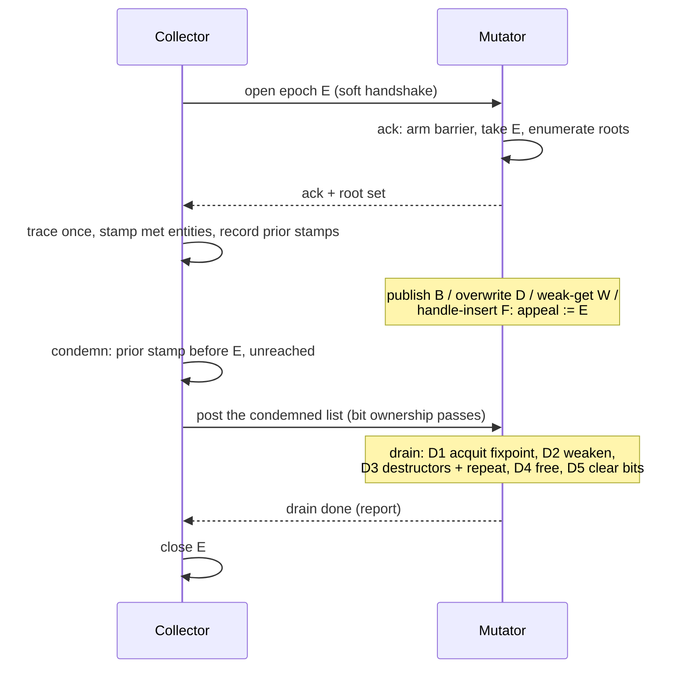

# appeal-walk: a collector without mutator reference counts

**Status:** design sketch, revised after two critic rounds; not decided
**Recorded:** 2026-08-16, from a design conversation
**Predecessors:** `NO_RC_PUBLISHED_EPOCH_GC.md` (the research frame and the
alternatives it compares), `RC_WALK_CRITICAL_REVIEW.md` (findings carried
below), `rfc/model/gc/rc-walk.md` (the epoch protocol this design reuses)

## Definition

appeal-walk is a collection scheme for the single-mutator model in which the
mutator keeps no reference counts on entities. The collector traces one
snapshot of the heap, condemns what the snapshot calls unreachable, and
posts the condemned list to the mutator. The mutator corrects the verdict at
its drain checkpoint: a condemned object carrying a current-epoch appeal was
referenced again after the snapshot and is acquitted, together with
everything reachable from it inside the condemned set; the rest is freed.

The name extends rc-walk's court vocabulary. rc-walk already has verdicts,
acquittals, and a drain; here the verdict is provisional, and the drain
hears the appeal: the case is retried on current evidence, then upheld or
overturned.

## Header fields and their writers

Epoch numbers run 1..255 and wrap; 0 is reserved as "never". Removing
entity reference counts frees the header's count half
(`src/refcount.rs::RcHeader.refcount`). COW values keep real counts in
that half and their own death path, which is why the barrier discriminates
COW on its fast path (below): one appeal byte written into a live count
would turn a shared string unique (`cow_separation_needed`) and corrupt
data, not retain it.

| Field | Place | Writer | Reader | Meaning |
|---|---|---|---|---|
| walk stamp | flags byte 6 (today's epoch byte) | collector | both | epoch that last met the entity; 0 = never met |
| condemned | one bit of flags byte 7 | collector until posting, then the drain | mutator, at the drain | member of the posted death list |
| appeal | one byte of the freed count half | mutator | mutator, at the drain | epoch of the last publication; current means "referenced after the snapshot" |

The mutator's whole-word header stores can bury a concurrent collector byte
store, exactly as they bury the walk stamp today; a buried stamp delays
condemnation by an epoch, and a buried condemned-bit **set** makes the
drain ignore the entry. Sets err toward retention; clears do not, which is
why condemned-bit clearing belongs to the mutator (D5 below) and the
collector never clears a bit a mutator might be rewriting.

The condemned bit is a membership test, not the verdict itself: the posted
list already names the objects, and the drain uses the bit for an O(1)
"inside the condemned set" answer during the acquittal retrace. The
free/ignore contract stays conservative: free only on condemned set and no
current-epoch appeal.

## Maturity: the barrier's predicate and the grace epoch

The barrier's target test is object-local and reads only the flags word it
already loads:

```text
barrier-relevant(B) = not COW(B) and (walk_stamp(B) != 0
                                      or category(B) == RequestArena)
```

The COW term keeps the appeal byte out of live counts, as above. The arena
term exists because arena blocks sit outside the census: their entities
keep stamp 0 forever, and without the term no barrier half fires for a
parked escapee — the drain would free it under a live frame reference. An
appeal on a live-arena entity is harmless retention, and an arena entity's
count half carries no hold-count under this design, so the byte is free.

Condemnation pairs with a grace rule: **epoch `E` condemns only heap
entities whose stamp, as recorded by `E`'s census at the moment of
meeting, names an epoch earlier than `E`**. The census stamps every entity
it passes with `E` and records the prior value; an entity born after the
previous census carries 0, is stamped on first meeting, and becomes
condemnable one epoch later. This is allocate-black stretched to the first
meeting: young garbage lives one extra epoch.

The soundness argument is a happens-before, not byte identity — the
barrier reads the header byte while the collector decides from its
recorded copy, and the two agree where it matters:

- A condemnable entity's recorded stamp names an earlier epoch, so its
  header byte was non-zero before `E` opened and stays non-zero for the
  whole epoch — the census only overwrites it with `E`, and a mutator
  burial restores the pre-census value, which was non-zero. Every armed
  barrier read on a condemnable entity therefore sees "mature" and files
  the appeal.
- An armed read that sees 0 saw an entity whose pre-census stamp was 0,
  which the grace rule keeps out of `E`'s condemnable set; the skipped
  appeal costs nothing.

Stamp wraparound aliases a recorded stamp with the current epoch once per
255 epochs, which defers that entity's condemnation by one epoch;
retention. The header read itself is the relaxed whole-word load the
header already compiles to under rc-walk; no ordering is required, only
the atomic annotation that keeps the race defined.

## The write barrier

Armed from the mutator's epoch acknowledgement until the drain completes;
the acknowledgement also hands the mutator the epoch number `E` for the
appeal stamp.

While armed, the mutator writes `appeal := E` (test-first: skip when the
stamp already reads `E`) on every barrier-relevant target of three
operations:

1. **Publication** — the stored reference's target (the Dijkstra half).
2. **Overwrite** — the replaced slot value's target (the Yuasa half). It
   answers the reference that survives only in a root: load the sole
   reference into a register, null the slot, and half 1 never fires; the
   nulling itself files the appeal. The pair is Go's hybrid barrier, and
   its published property carries over: roots are captured once per epoch,
   never recaptured.
3. **Materialization** — any operation that mints or stores a strong
   reference outside the strong graph's slots: a weak-cell upgrade
   (`ll_weakref_get`), and the FFI handle table on **both** doors —
   insertion and fetch. Insertion is the door an implementer misses: a
   destructor that registers a doomed sibling with an FFI subsystem
   performs no heap store and no fetch, and without the insertion gate the
   handle table roots freed memory one epoch later. The handle table is a
   barriered container, not a runtime-native structure.

Ordinary field loads need no barrier: a loaded reference matters to the
drain only if its source slot dies (half 2 fires) or it is republished
(half 1 or 3 fires). Conditioning any gate on the condemned bit would
reopen the clear-only window below; while armed, the appeal is
unconditional.

Cost, honestly: the old-value load of half 2 was paid by the RC decrement
this design removes, so the armed barrier is two header loads, the
discrimination branch (COW, category), and up to two stamp writes per
store — close to the cache profile of the RC pair it replaces. The idle
path is one disarmed test **plus the category barrier that survives RC
removal**: the arena dirty bit must be maintained on every escaping store
whenever an arena is mounted, and today that discrimination is a
target-header load (`src/memory/barrier.rs`). An address-range test
against the arena block set instead of the header load is the design
option that would make the idle path genuinely cheap; it is undecided, and
the benchmark rows price both readings.

## Why the appeal is recorded at the store, not at the verdict

A clear-only variant — the collector sets condemned, the mutator merely
clears it on publication — frees a live object through this window:

1. The trace observes the last snapshot reference to `B` removed; to the
   collector, `B` is garbage.
2. The mutator republishes `B` into a live object. No condemned bit exists
   yet, there is nothing to clear, and the store leaves no record.
3. The collector condemns `B` and posts it.
4. The drain sees condemned set and no appeal, and frees a reachable
   object.

The store-time appeal closes the window: the evidence exists for the whole
epoch instead of beginning at condemnation.

## Appeal freshness: why a stamp and not a bit

A sticky appeal bit needs clearing, and the approaches were weighed:

- **Sticky bit, drain clears processed members only.** Safe; each object
  published in `E` and condemned in a later epoch is spuriously acquitted
  once and floats one extra epoch. Under steady churn a fraction of every
  condemned list arrives pre-appealed.
- **Parity pair.** Halves the rate and keeps the failure: a death at even
  epoch distance still meets its stale bit.
- **Collector clears stale bits during the trace.** Rejected outright: a
  clear racing a same-epoch set can lose the set, and a lost appeal frees
  a live object — the only variant whose error direction is fatal.
- **Epoch stamp** — chosen. `appeal == E` is the only reading the drain
  trusts, so stale appeals expire by themselves, nothing is cleared, and
  no publication log exists. The byte costs nothing: the count half is
  free for entities, and `E` reaches the mutator in the acknowledgement it
  already receives. Aliasing needs the same object published in `E` and
  condemned in `E+254` exactly; the price is one spurious acquittal,
  retention.

## Roots

At the acknowledgement the mutator enumerates its own roots and posts them;
the collector never scans a running stack, because a reference in a
register, or in a frame pushed behind the scanner, is invisible to it and
would be freed live. The enumeration is a real safepoint: it runs inside
the checkpoint, costs a pause proportional to stack depth, and needs no
native stack maps — the roots of this runtime are VM frames, which the
runtime walks itself. Native code reaches entities only through the handle
table, which is both a root source and a materialization gate (barrier
rule 3). One compiler contract remains: across a checkpoint, no strong
reference lives only in registers.

The scheme therefore has two synchronization points, the acknowledgement
and the drain, both on the mutator's own checkpoints.

## The drain

The drain runs on the mutator at one checkpoint; user code runs only in
D3, and epoch checkpoints inside release paths are masked for the whole
drain — a drain must not re-enter the epoch protocol. `L` is the posted
list; membership tests use the condemned bit.

- **D1, acquittal fixpoint.** Seeds: members of `L` whose appeal reads
  `E`, and parked-arena entities whose appeal reads `E` (they join the
  survivor set the same way condemned members are acquitted). Retrace from
  the seeds through strong slots, **passing through COW values
  transparently — exactly as the trace does — and pruning at live
  non-COW entities**: a post-snapshot edge from live-land into `L` files
  its own appeal, so live entities need no traversal, but a COW
  intermediary is no evidence and must be crossed, or a live entity hidden
  behind a sole-held array dies with the array's condemned holder. Acquit
  every member of `L` reached and add every parked entity reached to its
  survivor set. No user code, no frees; terminates because acquittal is
  monotone over a finite set.
- **D2, weak severing.** Null every weak cell whose target is still
  doomed. A later resurrection does not restore the cell: a weak reference
  to an object that reached D2 reports dead, as in rc-walk today.
- **D3, destructors.** One pass: run the destructor of every still-doomed
  member, once per object, as in rc-walk; a member acquitted after its
  destructor ran stays destructed — the existing resurrection semantics.
  No memory has been released, so a destructor reading a doomed sibling's
  slot reads valid memory. The barrier is armed, so a destructor that
  publishes, registers (handle insertion), or weak-upgrades a doomed
  object stamps its appeal — **the appeal is the resurrection detector**.
  After the pass, repeat D1 seeded by the fresh appeals and repeat D2 for
  weak cells created during the pass. Nothing loops further: destructors
  run at most once each, the doomed set only shrinks, and no user code
  runs after the pass.
- **D4, release.** No user code runs past this point — COW kinds carry no
  destructors — so no reference to a doomed object can appear. The
  release traverses each doomed entity's slots to drop its counted COW
  children (their teardown is memory work only, under the masked
  checkpoints above), then frees doomed slots into the mutator's own
  allocator, in any order. Reclamation is the drain's, on the owning
  thread; the collector never frees.
- **D5, bit hygiene and report.** The **drain** clears the condemned bits
  of acquitted members before disarming: condemned-bit write ownership
  travels with the posted list and returns to the collector at "drain
  done". A collector-side clear was rejected — it is a byte store racing
  the mutator's whole-word flag stores (`mutator_update_flags`), a buried
  clear reinstates the bit on a live object with no future epoch to
  remove it, and every later retrace that touches the object walks out of
  the posted list into the live graph. The drain-done report tells the
  collector which slots died, for its accounting; it carries no bit
  obligations.

Appeal stamps are not cleared: next epoch they are stale by construction.

Two abort rules close the unhappy paths. A collector that abandons an
epoch after setting condemned bits but before posting still owns the bits
and clears them itself. A mutator that tears down with a posted, undrained
list runs the drain at its teardown checkpoint, where parked memory
already returns today.

## Epoch shape

1. The collector opens epoch `E` through the existing soft handshake.
2. Inside the acknowledgement the mutator arms the barrier, takes `E` for
   the appeal stamp, and enumerates its roots.
3. The collector traces the snapshot once, stamping every entity the
   census passes and recording the prior stamp. Publications during the
   trace are not discovered and need not be: the appeal answers them at
   the drain. There is no worklist, no fixpoint, and no termination
   protocol.
4. The collector condemns heap entities whose recorded pre-census stamp
   names an epoch earlier than `E` and that the trace did not reach, sets
   their condemned bits, and posts the list — bit ownership passes with
   it.
5. The mutator drains at a checkpoint: D1 to D5 above.
6. The collector consumes the drain-done report for its accounting and
   closes the epoch. Freed slots are already home: the drain freed them
   on the owning thread.



## What this removes, relative to the V8-shaped leader

The parent document's leading candidate — target shading with a marking
worklist — obliges the collector to discover every publication during the
epoch and to prove that discovery terminates. appeal-walk removes the
obligation: the trace is one pass over a stale snapshot, and staleness is
repaired at the drain. The marking worklists, the side bitmap, and the
mutator CAS on shared marking state are removed with it; the appeal lives
in a mutator-owned byte, and the collector's header writes stay confined
to its stamp byte and to condemned-bit sets it owns until posting.

## Arenas: parked resets inside the common drain

Today the write barrier records each first escape in an arena-owned log
(`src/memory/arena.rs`, `log_escapee`) and keeps the escapee's `refcount`
as an escape hold-count (`IS_ESCAPEE`); holder teardown decrements it, and
the reset runs a count-driven fixpoint (`src/promote.rs`,
`rfc/model/memory/arena-reset.md`). Under rc-walk this stays the default:
the log fires only on escaping stores, which the arena design assumes
rare, and a clean arena's reset is already cheap. A "scan at reset on the
mutator" replacement loses at both ends — rare escapes make the saving
negligible, frequent escapes make every reset pay a whole-heap scan — and
is not pursued.

Under appeal-walk the log cannot stay: the hold-count is a reference
count. The replacement folds arenas into the epoch:

- The barrier keeps one arena bit, "has escapees". A clean arena resets
  immediately, as today. A dirty arena's reset parks its blocks instead of
  scanning; the bit's writer and reader are both the mutator.
- Parked entities are barrier-relevant by category (the maturity
  predicate above), so every publication, overwrite, or upgrade of one
  during the epoch stamps its appeal — without the category term the
  stamp reads 0 and a parked escapee held only by a frame is freed live.
- The next epoch's trace, which walks the live graph anyway, records every
  reference into parked blocks and posts, next to the condemned list, the
  **survivor set** of each parked arena. Survivors are computed by the
  trace, not by counts; the drain's D1 corrects the set by appeals and
  retraces from appealed parked entities, so their arena-internal
  children survive with them.
- A destructor that resurrects a parked entity stamps its appeal, and the
  D3 repeat adds it to the survivor set.
- Promotion happens in the drain, on the mutator, after D3 settles:
  rewrite each survivor's category to `GcHeap` and retain every block that
  carries at least one survivor (`BLOCK_KIND_RETAINED`). Retention is
  block-granular, so a resurrected entity keeps its block by
  construction; the pool sees only blocks with no survivors at all.

The old reset fixpoint existed because destructors create new escapes; its
work is now the D3 repeat, and the compensating-retain and COW-count
reconciliation die with the counts they maintained. The release-at-reset
log's obligations move into D4's slot traversal. The costs repeat the
appeal-walk costs in miniature: a dirty arena's memory floats until the
next epoch, and its destructors run at the drain, which the 2026-08-16
destructor ruling permits. The decisive metric is reset cadence against
epoch cadence: a request-scoped arena dirty on every request floats every
request's memory for a whole epoch.

## Benchmark plan across strategies

The choice among rc-trace, rc-walk, and appeal-walk is end-to-end; the
parent document's experiment matrix (items 1–8 and the end-to-end metrics)
applies to all three under one workload and one machine. This design adds
its own rows:

- hot-path triple, armed: current RC publish against the **full** hybrid
  barrier — both flag loads, the discrimination branch, both stamp
  writes — against a card mark;
- idle path, both readings: RC publish against the disarmed test with the
  surviving category barrier as a header load, and again with the
  address-range variant;
- poll overhead: the compiler-inserted checkpoints that replace the
  release-driven checkpoint network (see below), priced next to the
  barrier;
- share of publications whose target is COW-valued rather than an entity:
  COW values keep RC either way, so this share bounds the whole benefit;
- drain time split into acquittal retrace, destructors, and release;
- share of arena resets with the dirty bit set, escapees per dirty reset,
  and floating bytes a parked arena adds per epoch;
- appeals per epoch against condemned-list size: how often the verdict is
  overturned, and how often by a stale-alias appeal.

## What this does not solve

Carried open costs, unchanged from the parent document and the rc-walk
review:

- **Slot atomicity.** The trace reads reference slots the mutator is
  writing. Every reference field the trace can reach must be accessed as a
  relaxed atomic, or the concurrent read is undefined behaviour; V8 pays
  exactly this price.
- **COW uniqueness.** Strings and arrays answer "unique?" with the count
  today and keep their counts here; how counted values and traced entities
  share cycles is unresolved, and the options stay as listed in the parent
  document.
- **Destructors.** Ruling 2026-08-16: determinism at the last release is
  not required. The drain fixes the place; the latency remains unbounded
  by anything but epoch cadence.
- **Floating garbage.** Everything published or appealed during the epoch
  survives it, young garbage waits out the grace epoch, and parked arenas
  wait for the next epoch; the transient bound is churn × epoch duration
  (review, finding 3).
- **Checkpoint density.** Today acks and drains ride the death branch of
  entity releases, and appeal-walk deletes entity releases; the surviving
  sites are COW deaths and the allocation poll, so an entity-mutating
  workload without allocation pressure would never ack and never drain —
  and the drain is the only reclamation path for entities.
  Compiler-inserted polls (function entries, loop back-edges) stop being
  an option and become part of the design; their cost is a benchmark row
  above. Review finding 2 applies on top: no bound exists between a
  checkpoint being due and being reached.
- **Barrier coverage.** Bulk copies, movable-storage moves, and
  arena-to-heap stores must pass the appeal discipline; the parent
  document's coverage questions apply verbatim.

## Decision gate

Inherited from the parent document minus the discovery and termination
items, plus:

1. Prove the barrier window: armed at the acknowledgement, disarmed after
   the drain, no store outside the window can touch a condemned
   candidate, and the condemned-bit ownership handoff — collector until
   posting, drain until drain-done — is part of the proof, abort paths
   included.
2. Audit the materialization gates: enumerate every runtime operation that
   mints or stores a strong entity reference outside barriered slots —
   weak upgrade, handle insertion, handle fetch, and whatever the audit
   finds — and show each one stamps the appeal.
3. Prove the drain's two-pass structure sound against rc-walk's Phase 4
   danger cases and measure its cost on large components — the drain
   already is the pause (review, finding 6).
4. Measure the hot path against current RC publication and card marking —
   full barrier, idle path in both readings, poll overhead — and measure
   the COW share that bounds the benefit.
5. Write the root contract: VM-frame enumeration at the acknowledgement,
   the compiler rule that no strong reference lives only in registers
   across a checkpoint, and the poll-placement rule that keeps checkpoint
   density above the drain's needs. The gate does not open on benchmarks
   alone.
