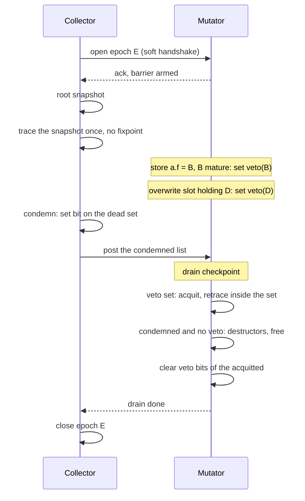

# veto-walk: a collector without mutator reference counts

**Status:** design sketch, not a decided design
**Recorded:** 2026-08-16, from a design conversation
**Predecessors:** `NO_RC_PUBLISHED_EPOCH_GC.md` (the research frame and the
alternatives it compares), `RC_WALK_CRITICAL_REVIEW.md` (findings carried
below), `rfc/model/gc/rc-walk.md` (the epoch protocol this design reuses)

## Definition

veto-walk is a collection scheme for the single-mutator model in which the
mutator keeps no reference counts. The collector traces one snapshot of the
heap, condemns what the snapshot calls unreachable, and posts the condemned
list to the mutator. The mutator corrects the verdict at its drain
checkpoint: a condemned object whose veto bit is set was referenced again
after the snapshot and is acquitted, together with everything reachable from
it inside the condemned set; the rest is freed.

The name extends rc-walk's court vocabulary. rc-walk already has verdicts,
acquittals, and a drain; the mutator's veto is the piece this design adds.

## What replaces the reference count

In rc-walk, a publication changes a count, and the Phase 3 recheck acquits
any candidate whose count moved. Without counts that evidence is gone;
veto-walk compresses it to one bit: not "how many references", but
"referenced again since the snapshot".

Two header bits, each with exactly one writer:

| Bit | Writer | Reader | Meaning |
|---|---|---|---|
| condemned | collector | mutator, at the drain | member of the posted death list |
| veto | mutator | mutator, at the drain | published or overwritten after the snapshot |

The condemned bit sits in the collector's header byte (byte 6, today the
epoch stamp: `src/refcount.rs`, `EPOCH_BYTE_SHIFT`). The veto bit sits among
the mutator's flag bits. The mutator's whole-word header stores can bury a
concurrent condemned store, exactly as they bury the epoch stamp today; a
buried condemned bit makes the drain ignore the object, which retains it for
one epoch and frees nothing early. The collector writes only its own byte,
so a veto bit cannot be buried. Every lost update in this scheme errs
toward retention.

The condemned bit is a membership test, not the verdict itself: the posted
list already names the objects, and the drain uses the bit for an O(1)
"inside the condemned set" answer during the acquittal retrace. The
free/ignore contract stays conservative: free only on condemned set and
veto clear.

## The write barrier

Armed from the mutator's epoch acknowledgement until the drain completes.
On every reference store inside that window the mutator:

1. sets the veto bit of the new target, if the target is mature — allocated
   before the epoch (allocate-black already keeps younger objects outside
   the reclamation set);
2. sets the veto bit of the overwritten target, under the same maturity
   test. The store path reads the old slot value today to decrement it, so
   this load is already paid.

Half 1 is a Dijkstra insertion barrier and answers republication. Half 2 is
a Yuasa deletion barrier and answers the reference that survives only in a
root: load the sole reference to an object into a register, null the slot,
and half 1 never fires — the trace misses the object and the drain frees it
live. With half 2 the nulling itself sets the veto. The pair is Go's hybrid
barrier, and its published property carries over: stacks are scanned once
per epoch, never rescanned.

The set is test-first and idempotent. The header word is already loaded for
the maturity test, so the barrier costs one read on the hot path and at
most one veto write per mature object per epoch; outside an epoch it costs
the armed test alone. The barrier arms at the existing acknowledgement
(`src/epoch.rs`) before the collector takes its snapshot, so no store
inside the epoch can precede the armed barrier.

## Why the veto is recorded at the store, not at the verdict

A clear-only variant — the collector sets condemned, the mutator merely
clears it on publication — frees a live object through this window:

1. The trace observes the last snapshot reference to `B` removed; to the
   collector, `B` is garbage.
2. The mutator republishes `B` into a live object. No condemned bit exists
   yet, there is nothing to clear, and the store leaves no record.
3. The collector condemns `B` and posts it.
4. The drain sees condemned set and veto clear, and frees a reachable
   object.

The veto closes the window because it is written at the store: the evidence
exists for the whole epoch instead of beginning at condemnation.

## The drain

At its checkpoint the mutator walks the posted list:

- condemned bit missing: ignore — a buried store or a stale entry;
- veto bit set: acquit, then retrace from the object through the condemned
  set and acquit every member reached. A veto on `B` says nothing about `C`
  reachable from `B`; acquittal is transitive or it frees live children.
- condemned set, veto clear: free through the existing Phase 4 machinery —
  weak cells nulled, destructors run, resurrection recheck, then release.

Veto bits of acquitted members are cleared before the drain returns, by
their only writer. The whole drain runs on the mutator at one checkpoint,
which is the single synchronization point of the scheme.

## Epoch shape

1. The collector opens epoch `E` through the existing soft handshake; the
   acknowledgement arms the barrier.
2. The collector obtains a root snapshot. Without counts there is no
   `RC − IN` derivation; the root cost is open, see below.
3. The collector traces the snapshot once. Publications during the trace
   are not discovered and need not be: the veto answers them at the drain.
   There is no worklist, no fixpoint, and no termination protocol.
4. The collector sets condemned bits on the dead set and posts the list.
5. The mutator drains at a checkpoint: acquit by veto, free the rest.
6. Veto bits are cleared, the epoch closes, slots return to the allocator.

## What this removes, relative to the V8-shaped leader

The parent document's leading candidate — target shading with a marking
worklist — obliges the collector to discover every publication during the
epoch and to prove that discovery terminates. veto-walk removes the
obligation: the trace is one pass over a stale snapshot, and staleness is
repaired at the drain. The marking worklists, the side bitmap, the mutator
CAS on shared marking state, and the mixed-size atomic access to the header
word are removed with it; the veto bit is written by the thread that owns
the word.

## What this does not solve

Carried open costs, unchanged from the parent document and the rc-walk
review:

- **Roots.** `RC − IN` is unavailable without counts. One root enumeration
  per epoch remains: exact stack maps, or a conservative scan at the
  acknowledgement checkpoint. This is the largest unfunded item.
- **Slot atomicity.** The trace reads reference slots the mutator is
  writing. Every reference field the trace can reach must be accessed as a
  relaxed atomic, or the concurrent read is undefined behaviour; V8 pays
  exactly this price.
- **COW uniqueness.** Strings and arrays answer "unique?" with the count
  today; the options stay as listed in the parent document.
- **Destructors.** Ruling 2026-08-16: determinism at the last release is
  not required. Timing and thread remain to be specified.
- **Floating garbage.** Everything published or vetoed during the epoch
  survives it; the transient bound is churn × epoch duration (review,
  finding 3).
- **Progress.** The epoch still opens and drains at mutator checkpoints;
  finding 2 of the review applies unchanged.
- **Barrier coverage.** Bulk copies, movable-storage moves, arena-to-heap
  and FFI stores must all pass the veto discipline; the parent document's
  coverage questions apply verbatim.

## Decision gate

Inherited from the parent document minus the discovery and termination
items, plus:

1. Prove the barrier window: armed at the acknowledgement, disarmed after
   the drain, and no store outside the window can touch a condemned
   candidate.
2. Prove that transitive acquittal terminates, and measure its drain cost
   on large components — the drain already is the pause (review, finding
   6).
3. Measure the hot path against current RC publication and against card
   marking (parent document, experiments 1–8).
4. Design and cost the root enumeration; the gate does not open on
   benchmarks alone.
