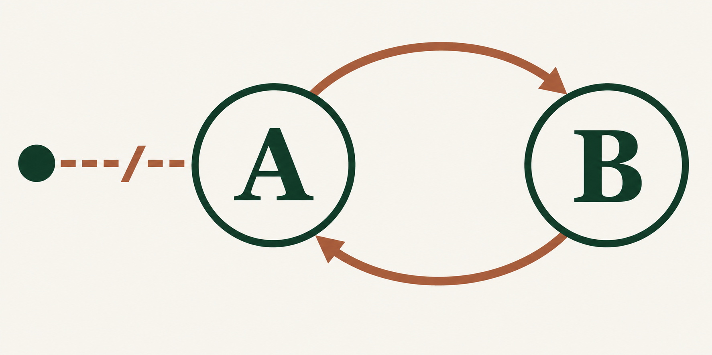
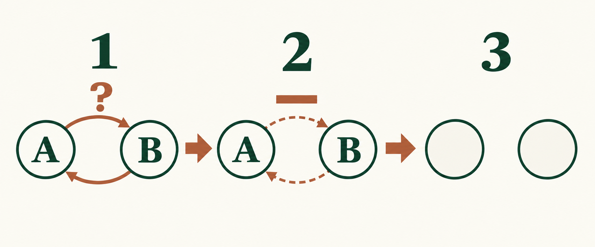
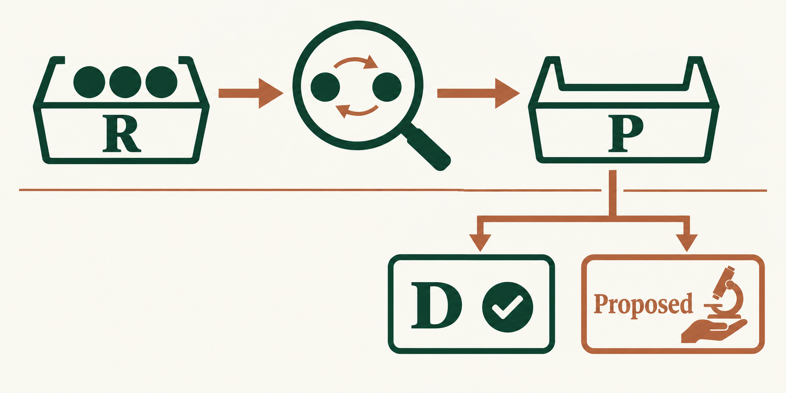

# Почему Limelight вернулся к сборщику циклов PHP

*От подсчёта ссылок до формы D: история алгоритма и опытов, которые не прошли проверку.*

Я перебрал много подходов к сборке мусора: читал, как с памятью работают Go и сборщики Java, сравнивал размещение объектов, обход кучи и цену фоновой работы. В результате для Limelight я вернулся к основе, знакомой по PHP: подсчёт ссылок плюс поиск циклов. Причина лежит в простой картинке.

Представим два объекта. Пока на `A` указывает переменная программы, оба нужны. Теперь переменную удалили. `A` по-прежнему ссылается на `B`, а `B` — на `A`; у каждого счётчик равен единице. Память занята, хотя программа уже не может добраться ни до одного объекта.

*После удаления внешней ссылки у цикла остались только внутренние ссылки. Нулевого счётчика нет — обычное освобождение не сработает.*

Отсюда два способа искать мусор. Можно начать от корней программы и проследить все достижимые объекты. Можно, уже зная подозрительное место, мысленно вычесть ссылки внутри него: если после вычитания не осталось внешнего держателя, перед нами мусор. Первый путь лежит в основе трассирующих сборщиков. Второй — в основе **пробного удаления** циклов. Обоим нужны чтения памяти; параллельная работа добавляет согласование с исполняющейся программой.

## Почему не готовый рецепт из Go или Java

У Go конкурентный трассирующий сборщик: он отмечает живые объекты от корней и затем освобождает неотмеченные. Он **не перемещает** объекты. Цена такого решения связана с размером живого графа, барьером записи и иногда с помощью, которую программа оказывает сборщику при быстром выделении памяти. У Java нет одного сборщика на все случаи. Например, G1 переносит обычные живые объекты между регионами и тем самым уплотняет память; при этом нужно обновлять ссылки, а закреплённые объекты требуют особого обращения. Это разные разумные компромиссы, а не недостаток Go или Java вообще. [Руководство Go](https://go.dev/doc/gc-guide), [исходник сборщика Go](https://go.dev/src/runtime/mgc.go), [документация G1](https://docs.oracle.com/en/java/javase/26/gctuning/garbage-first-g1-garbage-collector1.html).

Для Limelight условия были иными. Его объекты с прямым указателем сохраняют адрес; решение избавляет генератор LLVM от точек переноса и карт стека, а чтения и записи — от барьеров **ради перемещения**. Объекты, размещённые в аренах, вообще не попадают в сборщик циклов. Если счётчик ссылки достигает нуля, обычное разрушение начинается сразу. Для циклов нужны деструкторы, слабые ссылки и проверка возможности «воскрешения» объекта. Адресная стабильность сама по себе не отличает Limelight от Go. Отличие — в области поиска: внешние держатели уже учтены счётчиками, поэтому сборщику можно давать кандидатов после уменьшения счётчика, не начиная каждый раз с перечисления всех корней программы. [Решение о неподвижных объектах](../../rfc/model/gc/heap-design.md), [контракт стратегии](../../rfc/model/gc/strategies.md), [алгоритм циклов](../../rfc/model/gc/rc-cycle.md).

## База: алгоритм сборки циклов PHP

Когда счётчик объекта уменьшается, но остаётся ненулевым, он может оказаться частью недостижимого цикла. PHP записывает такой объект как *возможный корень*. Позже сборщик пробно вычитает вклад внутренних ссылок. Там, где остаётся внешняя ссылка, он восстанавливает счётчики; часть без внешних ссылок освобождает. В классическом описании PHP кандидат фиолетовый, пробно пройденный объект серый, живой чёрный, мусор белый. Механизм восходит к работе Bacon и Rajan; руководство PHP описывает её синхронный вариант. [Руководство PHP](https://www.php.net/manual/en/features.gc.collecting-cycles.php), [реализация Zend](https://github.com/php/php-src/blob/master/Zend/zend_gc.c).

*Здесь у цикла нет внешнего держателя: после пробного вычитания внутренние счётчики равны нулю. Пунктир означает вычитание вклада ссылок, а не их физическое удаление. При внешнем держателе объекты сохраняют.*

Limelight заимствует принцип регистрации кандидатов, но не копирует PHP побайтно. В его пробном проходе счётчики **теневые**: сборщик вычитает внутренние ссылки во временных строках, не меняя настоящие счётчики объектов. Прерванный проход поэтому не требует отката кучи. [Описание пробного удаления Limelight](../../rfc/model/gc/rc-cycle.md).

## А если поиск передать другому потоку?

Синхронный поиск может остановить поток, исполняющий программу, именно тогда, когда он занят своей работой. В Limelight этот поток называется *мутатором*. Он записывает кандидатов в очередь `R`. Отдельный поток коллектора берёт ограниченную пачку, читает граф, выполняет `mark` и `scan` над теневыми счётчиками и отправляет результат в очередь `P`. Токен не допускает одновременных трассировок кучи одного владельца и защищает читаемые слоты от повторного использования. Программа при этом продолжает менять ссылки; предварительное чтение не является снимком графа. [Устройство потоков](INDEX.md), [протокол сборщика](../../rfc/model/gc/rc-cycle.md).

Поэтому коллектор **предлагает**, а мутатор **решает**. Если чтение нашло компоненту, похожую на мусор, результат `Proposed` требует точной проверки текущих счётчиков и рёбер на потоке владельца. Там же выполняются деструкторы, проверка после них и фактическое освобождение. Другие результаты означают: `ReadLive` — корень прочитан как живой; `ZeroCount` — счётчик уже ноль; `Unwalked` — полный ответ не получен, нужна новая попытка. Эти четыре результата появились до формы D. [Четыре результата в RFC](../../rfc/model/gc/rc-cycle.md), [точная проверка и закрытие](../src/cycle/collect.rs).

## Форма D: не готовить трассировку, если проверять нечего

Перенос поиска в другой поток оставил неожиданную плату. Для собственного обхода мутатор подготавливает временную рабочую память и защищает слоты, которые может прочитать; это называется *окном трассировки*. Ранний вариант открывал его при каждом ответе `P` — даже когда все корни были прочитаны живыми и ни один цикл не был предложен к освобождению. Форма **D** добавила отдельный сигнал: *в этой пачке нет `Proposed`*. Тогда мутатор разбирает `P` без окна и временной арены. Он по-прежнему обновляет отметки объектов, которые коллектор прочитал живыми, откладывает живые корни до следующей эпохи, возвращает непройденные на повторную попытку и освобождает удержанные слоты уже уничтоженных объектов. Если есть хотя бы один `Proposed`, остаётся обычный путь с точной проверкой. [Решение о форме D](DECISIONS.md), [обработка D](../src/cycle/collect.rs), [проверки переходов](../src/cycle/collect/tests/what_a_batch_without_a_proposal_owes.rs).

*Сверху — поиск коллектора, снизу — обработка мутатором. D применяется, когда среди результатов в P нет `Proposed`; сама очередь может содержать другие результаты. Ветка D не передаёт освобождение коллектору.*

## Что пробовали и чем заплатили

Числа ниже относятся к отдельным опытам проекта. В исправленном опыте это медианы трёх прогонов с отдельным ядром для коллектора; время последнего освобождения считают после остановки нагрузки.

| Опыт | Что получилось |
|---|---|
| **Ограниченная пачка.** Коллектор первым читает живые корни. | В старом опыте на общем живом графе **работа мутатора на одну сборку** сократилась с **658 832 до 15 365 инструкций**. На раздельных графах за пределом бюджета корни возвращались `Unwalked`, и выигрыша не было. Это исторический опыт до нынешних меток списка живых, не доказательство общего ускорения и не замер текущей D. [Замер](BENCHMARKS.md). |
| **Разбить пачку на части.** Уложить каждую часть в бюджет. | Мутатору приходилось меньше повторять после законченных частей, но на широких раздельных графах грант, **который никто не отзывал**, вырос до **32–37 мс против 0,24–0,27 мс**. Отзыв уже работал: после запроса ожидание мутатора составило 75–76 мкс. Бюджет памяти сам по себе времени гранта не ограничивал. [Замеры](BENCHMARKS.md). |
| **Держать живые корни у коллектора (H); быстро возвращать молодые корни (G).** | H снижала работу мутатора на большом долгоживущем множестве, но на нагрузке со сменяющимися циклами задерживала обнаружение мусора. G добавляла повторные чтения: на `live-churn` коллектор обработал **1,77 млн корней против 0,94 млн** у D. Старые проценты инструкций между разными размерами кучи здесь не используются. [H](BENCHMARKS.md), [G](BENCHMARKS.md). |
| **Дольше не перечитывать живой корень.** | На исправленном стенде в `deferred-live-large` инструкции мутатора **на итерацию** снизились с **17 774 до 14 672**. Но на `live-churn` объём неосвобождённого мусора к остановке нагрузки вырос с **10,0 до 36,9 МБ**, а после `deferred-then-dead` время последнего освобождения — с **4,2 до 8,6 с**. По принятым ограничениям основной вариант остался D. [Исправленный прогон](BENCHMARKS.md). |

В этой истории пришлось исправлять и измерительный стенд. Тестовая проверка каждого ребра обходила все регионы памяти и завышала инструкции при большой куче; старый интегральный счётчик не учитывал паузу между итерациями; другой счётчик пропускал освобождения в одном месте и создавал видимость оставшегося мусора. Поэтому прежние сравнения времени и инструкций для H/G нельзя механически переносить на нынешний код. Числа последней строки взяты из исправленного опыта, а вопрос дальнейшего ускорения остаётся открытым. [Разбор ошибок стенда](POSTMORTEM.md).

Форма D сохранилась как основной вариант **на проверенных нагрузках и по заранее заданным ограничениям**. Её идея проста: искать возможные циклы там, где уменьшился счётчик; тяжёлое предварительное чтение отдавать коллектору; решение о разрушении оставлять владельцу; не готовить новое окно трассировки, когда коллектор ничего не предложил. Следующее улучшение должно проверяться сразу по нескольким величинам: работе мутатора и коллектора, удержанному мусору, времени последнего освобождения и ожиданию токена. Экономия одного прохода ещё не доказывает выигрыша всей программы.
