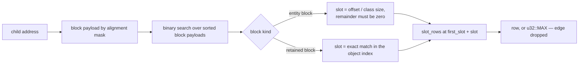

# Epoch walk data structures

The catalogue of every structure one collection epoch builds or leans
on, with its unit cost and the phase that owns it. Companion to
`epoch-walk.md`, written 2026-08-18 against the code of that day; the
code's doc comments stay the contract, and the "after S28" column
describes `PLAN.md` stage S28, not the present tree.

## The snapshot and the dense census

`Epoch::snapshot` copies the entity-block registry into
`blocks: Vec<EntityBlockSnapshot>` — one record per entity block, and
for a retained former-arena block the record carries the reset's object
index, since a bump-filled block has no stride. Beside it the census is
laid out flat:

| Field | Unit | Cost | Role |
|---|---|---|---|
| `first_slot` | per block | 4 B | prefix sum: block → its first census id |
| `slot_rows` | per slot | 4 B | census id → walked row, `u32::MAX` for none |

A child pointer found in a cell resolves to a row without hashing:

The remainder test rejects interior addresses, and a block absent from
the snapshot — heap buffer, arena, mid-commission — finds no payload
match, so a garbage word can point anywhere and still resolves to
"drop the edge". This lookup replaced a `HashMap` keyed by entity
address at a measured 2–3× on the walk step (`dev/BENCHMARKS.md`,
"dense census in the epoch walk").

## The row arrays

Pass 1 fills four parallel arrays, indexed by walked row:

| Field | Cost/row | Written by | Read by |
|---|---|---|---|
| `entities: Vec<*mut RcHeader>` | 8 B | pass 1 | every later phase |
| `rows: Vec<u32>` (snapshot refcounts) | 4 B | pass 1 | judge, Phase 3 counts |
| `flags: Vec<u32>` (kind, category, stamp) | 4 B | pass 1 | pass 2 dispatch, Phase 3 kind |
| `storage_versions: Vec<Option<usize>>` | 16 B | pass 2 | Phase 3 storage check |

The kind always comes from `flags`, never from a re-read of the header:
the mutator writes that word as one relaxed atomic store, and the
snapshot's copy is the value the walk judged by. `storage_versions` is
`None` for a kind that keeps its cells in its own slot and for an array
the walk gave up on; after S28.3 the same array holds bare `usize` at
8 B/row, `usize::MAX` the sentinel — legal versions are even, so the
odd sentinel is unreachable.

## The Edge record — 32 bytes

One recorded heap-internal edge, `collector::Edge`:

| Field | Size | Why it is carried |
|---|---|---|
| `src: u32` | 4 B | walked row of the holder — Phase 3 asks its storage version once per run |
| `dst: u32` | 4 B | walked row of the child — judge's `IN` side |
| `field: usize` | 8 B | the cell's address — Phase 3 re-reads exactly this cell |
| `raw: u64` | 8 B | the word read at walk time — the comparison operand |
| `shape: CellShape` | 1 B + 7 pad | whether a second word (the `Value` flags) exists beside `field` |

The shape byte costs eight with padding; the alternative — deriving the
width from the source's kind at re-check time — reads a header the
mutator is writing, so the byte is paid (`collector.rs`, the field's
comment). The list is transient, one epoch long. `judge` currently
copies it into `Vec<(u32, u32)>` for `garbage_components`; S28.2
removes that copy and hands the edges over in place.

## Grouping arrays inside `garbage_components`

Pure private math; nothing here touches shared memory.

| Array | Cost today | After S28.2 |
|---|---|---|
| `in_degree` | 4 B/row | unchanged |
| `marked` | 1 B/row | unchanged |
| root `stack` | up to 4 B/row | unchanged, pre-sized exactly |
| forward CSR (`offsets` + `cursor`) | 8 B/row | unchanged |
| forward CSR items | 4 B/edge | unchanged |
| undirected adjacency | `Vec<Vec<u32>>`: 24 B/row of empty shells before any content | flat CSR over candidate edges: 8 B/row offsets + cursor, 8 B/candidate-edge items |
| `component_of` | 4 B/row | unchanged |

The 24 B/row shells are the weight `dev/RC_WALK_CRITICAL_REVIEW.md`,
"Per-epoch graph metadata is heavy", prices at 24 MiB per million
walked rows. The mark walk's forward CSR covers every recorded edge;
only the undirected adjacency is restricted to candidate
(both-ends-unmarked) edges, and component enumeration is a `0..n` scan
over `!marked`, so an isolated candidate is a singleton with or without
edges.

CSR is two arrays: `offsets[i]..offsets[i+1]` brackets row `i`'s run in
a flat items array. A degree-count pass sizes the runs, a prefix sum
turns counts into offsets, a fill pass writes items through a cursor
copy; a self-edge contributes 2 to its row's undirected degree, one per
direction.

## Candidates and the Phase 3 distribution

| Structure | Cost | Owner |
|---|---|---|
| `candidates: Vec<Vec<u32>>` | per component + 4 B/member | judge → Phase 3 |
| `component_of` | 4 B/row | `recheck_and_post`, one pass |
| `component_edges: Vec<Vec<u32>>` | per component + 4 B/edge-in-candidate | `recheck_and_post` |

Both nested vectors here are sized by candidates, not by rows —
components are the epoch's product, normally few — and stay outside
S28's scope by that argument (named in the stage).

## The mutator-side protocol statics (`epoch.rs`)

| Static | Type | Role |
|---|---|---|
| `HANDSHAKE_REQUESTED` | `AtomicBool` | collector raises; next checkpoint acks and lowers |
| `HANDSHAKE_ACKS` | `AtomicU64` | monotonic; the `AcqRel` bump is the handshake's release fence |
| `OUTSTANDING_VERDICTS` | `AtomicUsize` | posted minus drained; the epoch cannot close above zero |
| `QUEUE` | `Mutex<VecDeque<ConfirmationMessage>>` | one message per confirmed component — a cold trickle, so a lock, not a CAS loop |
| `MID_DRAIN`, `TEARDOWN_DEPTH` | thread-local `Cell` | close the drain recursion; forbid pickup mid-teardown |

A `ConfirmationMessage` is the members' raw pointers; the collector
treats them as opaque ids, and only the owning mutator dereferences.

## The deferred-free ledger (`memory/deferred_free.rs`)

| Piece | Shape | Why this shape |
|---|---|---|
| `ACTIVE` | global `AtomicBool` | the free path's one relaxed load |
| `PARKED` | thread-local `Cell<*mut Vec<Parked>>` | no drop glue, so it survives TLS destruction order and stays readable from `ll_thread_exit` |
| `Parked` | `{ptr, free}` | which free to replay, named, not inferred |
| `DeferredFree` | `Allocation` \| `Chunk {capacity}` \| `RetainedPayload` | a chunk carries no metadata of its own, so its free takes the capacity back; a retained payload frees a pin, not bytes |

Parked memory is never written — a walker may still read it — and the
backlog flushes in reverse park order on the owning thread, only with
no epoch in flight.

## Per-row cost summary

| | Today | After S28 |
|---|---|---|
| census (`slot_rows`, per slot) | 4 B | 4 B |
| row arrays | 32 B | 24 B |
| grouping flat arrays | ~21 B | ~29 B (undirected CSR now flat) |
| grouping nested shells | 24 B | 0 |
| per edge (`Edge` + judge copy + forward CSR) | 32 + 8 + 4 B | 32 + 4 B, plus 8 B per candidate edge |

The stage's probe bounds the grouping at 32 B per added row, allocation
requests summed around the call; the row arrays' drop and the copies'
removal are pinned by layout tests and by reading, the suite green in
both configurations.
