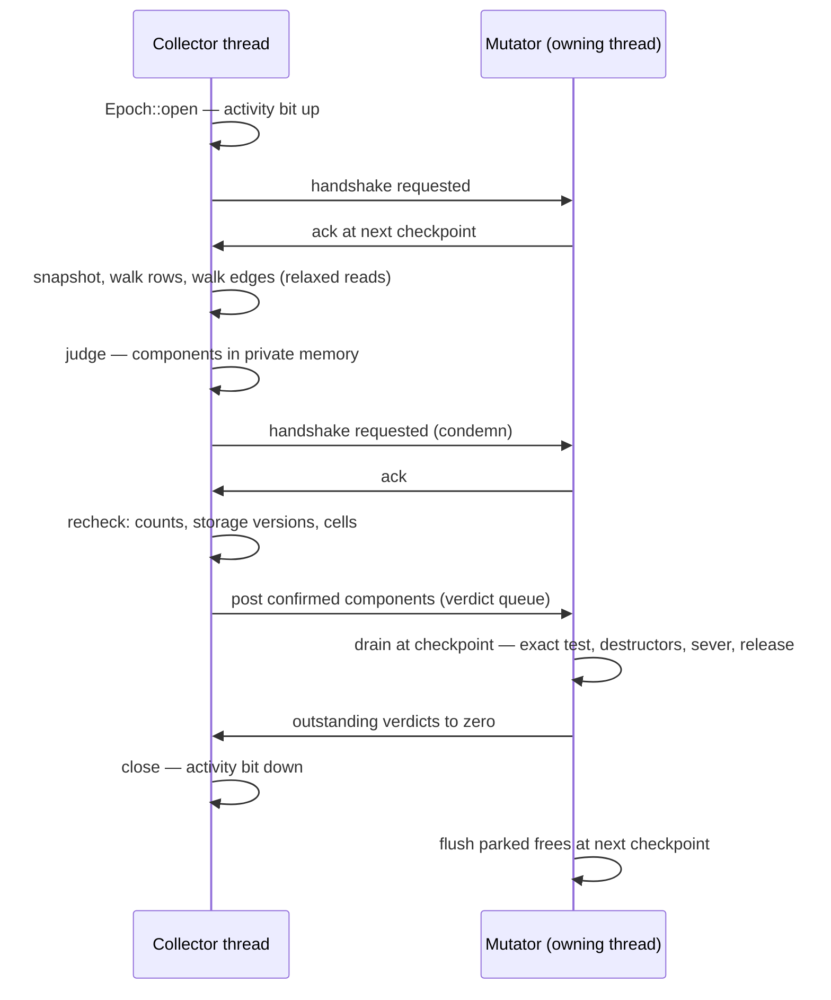
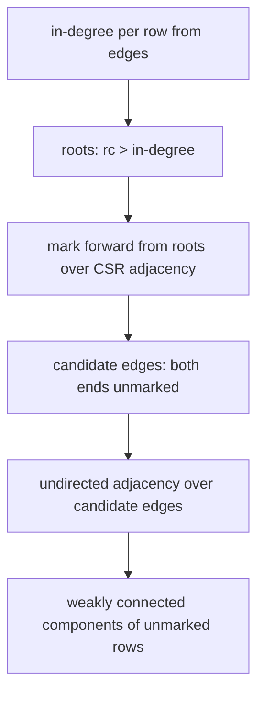

# The rc-walk epoch: how one collection runs

This note describes the concurrent collection epoch as implemented in
`src/collector.rs`, `src/epoch.rs`, `src/walk.rs` and
`src/memory/deferred_free.rs`. It is a reading aid, written 2026-08-18
against the code of that day: the normative design is
`rfc/model/gc/rc-walk.md`, and the doc comments in those four files are
the contract. The data structures the phases build are catalogued in
`epoch-walk-structures.md`; the closing section here names what stage
S28 (`PLAN.md`) changes.

## The central identity

A root is derived, never enumerated: over the walked population, an
entity with `RC − IN > 0` is held by something outside that population
and is therefore live. `RC` is the entity's reference count as
snapshotted; `IN` is the count of recorded edges into it from other
walked entities. Everything the identity cannot account for is treated
as an in-edge from outside — an unwalked entity, a dropped edge, an
array the walk gave up on — so every uncertainty pins its targets as
live. The design's currency is latency: a wrong reading costs one epoch
of leak, never an early free.

## The phase machine

The collector side is a stepped state machine (`collector::Epoch`), and
`run_epoch` chains the steps with waits. Tests call the steps one at a
time to force interleavings; production shape is one collector thread
against a checkpointing mutator.

```mermaid
stateDiagram-v2
    [*] --> Open : begin_epoch (park frees), request handshake
    Open --> Snapshot : mutator acked
    Snapshot --> WalkRows : entity blocks + retained indexes copied
    WalkRows --> WalkEdges : rows recorded, new entities stamped
    WalkEdges --> Judge : edges + storage versions recorded
    Judge --> Close : no candidates
    Judge --> Condemn : candidate components found
    Condemn --> Recheck : second handshake acked
    Recheck --> Drain : confirmed components posted
    Recheck --> Close : every component acquitted
    Drain --> Close : outstanding verdicts reach zero
    Close --> [*] : end_epoch; owners flush parked frees
```

The two handshakes carry the ordering. The first publishes the
deferred-free activity bit: a mutator that has not observed it could
still recycle a slot the snapshot is about to include, so the snapshot
waits for the ack. The second makes the mutator's writes up to its
checkpoint visible to the Phase 3 re-check (`AcqRel` on the ack count
against `Acquire` on the collector's read).

## The two sides

Checkpoints ride the death branch of `ll_release` (ack only) and the
full checkpoint sites: the outermost teardown's exit, the
`ll_gc_maybe_collect` poll, and the trailing end of a batched-release
run. The death branch never picks up a message, because between the
committing zero store and dispose the dying entity must meet no user
code; the full checkpoint refuses pickup mid-drain, mid-teardown and
during a synchronous collection, and acks the handshake regardless.

## Phase 1 — the walk, two passes

Pass 1 (`walk_rows`) classifies every snapshotted slot from one relaxed
load of its header word:

- `refcount == 0` — free or mid-teardown; occupancy is exact, skip.
- epoch stamp `0` or current — new since the last epoch: stamp it and
  skip (allocate-black); judgement waits one epoch.
- mature but not `GcHeap` — a root source; its edges count toward `RC`
  of their targets and never toward `IN`, skip.
- otherwise — a walked row: the entity pointer, its refcount and flags
  enter the parallel row arrays, and the slot's position enters the
  dense census.

Pass 2 (`walk_edges`) runs the one kind-dispatched tracer
(`walk::trace_cells`) over every row with the relaxed reader. Each
counted cell yields the cell's address, the raw word read there, the
child it designates and the cell's shape; the child is looked up in the
dense census (`census_row`), and a hit becomes an `Edge` while a miss is
dropped — conservative, the target keeps the phantom `RC`. An array's
cells are read through a coherent view of its storage head; a head
mid-move gives the array up for the epoch, recording nothing. The
version of the storage each row's cells came out of is recorded beside
the row.

The two passes are separately steppable because the window between a
count and the fields it guards is the raw material of the danger cases
(`rfc/model/gc/rc-walk-danger-cases.md`).

## Phase 2 — judge

`walk::garbage_components` is pure array math over the private snapshot:

Marking propagates liveness: a marked source's edges mark their
targets. What survives unmarked satisfies `RC == IN` transitively and
is grouped into weakly connected components — edges followed both
ways, so a garland of linked rings is judged as one unit. Worked
example: rows B and C with edges B→C and C→B. While a stack variable
also holds B, the counts read `rc(B) = 2, in(B) = 1` and
`rc(C) = 1, in(C) = 1`; B is a root (2 > 1) and marks C, so nothing is
a candidate. After that variable's release the counts read
`rc(B) = 1, in(B) = 1` — no root remains, and {B, C} is the candidate
component the identity means.

## Phase 3 — the comparison filter

Condemnation is private: the candidate list itself, nothing written to
the heap. After the second handshake the re-check compares, per
component and in this order:

1. every member's refcount against its walked row — a changed count
   acquits;
2. per edge source, the storage version against the walk's recording —
   sources arrive in runs, so one comparison covers a whole array; a
   moved storage acquits before any cell in it is re-read, because the
   old chunk is parked and frozen and would compare equal;
3. every recorded cell against its walked raw word, by shape — the
   payload word, and for a 16-byte cell the flags beside it.

Any difference acquits the whole component, silently; the hypothesis is
re-derived next epoch. A clean component is posted as one confirmation
message. Comparison, not recomputation: the filter asks "did anything
move", never "is it still garbage" — that question belongs to Phase 4.

## Phase 4 — the drain, on the mutator

`walk::drain_confirmed` trusts nothing it was told. The exact test runs
first over current fields: the corpse rule drops the message whole if
any member reads `rc 0` (it died ordinarily since posting), and
otherwise every member must satisfy `refcount == in-component
in-degree` exactly. Then, in order: guard every member (`+1`), null
every member's weak cells, run each pending `__destruct` once,
re-verify with the guard discounted if any destructor ran (a
resurrection acquits), sever every member's counted cells collecting
the displaced children, release the guards through the ordinary
teardown, and drop the external children last — no user code runs
between sever and free.

## What an epoch defers

While the activity bit is up, every physical release parks:
allocations, buffer-arena chunks with their capacities, retained-block
payloads. The queue's job is identity — an id must name one entity from
walk to drain — so parked memory is never touched, and each owning
thread flushes its backlog at the first checkpoint after the epoch
closes. The epoch may not end while verdicts are outstanding: that
ordering keeps at most one epoch's verdicts in flight, ever.

## What stage S28 changes

S28 (`PLAN.md`) touches sizes and copies, not the protocol: the
undirected adjacency of Phase 2 becomes flat CSR over candidate edges
instead of a per-row vector of vectors; `judge` stops copying the edge
list into pairs; the per-row storage version becomes one word with an
odd sentinel (`usize::MAX`, legal versions being even). Every phase
boundary, handshake and comparison above is unchanged.
