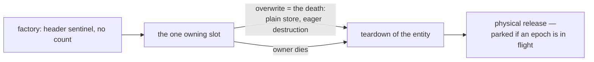

# Owned slots and the walk

A reading aid for the two designed-but-unbuilt ownership optimizations
of `rfc/model/gc/rc-walk.md` — "The birth count" and "Unique
ownership", both designed 2026-08-17 — and their composition with the
pure-destructor proposal (`pure-destructors.md`). Written 2026-08-18;
the RFC stays normative, and both features are gated in `PLAN.md` on a
Phase D measurement. The governing philosophy (Edmond): the collector
may do more work, the mutator strives to do nothing beyond the
program's own code — both features are that philosophy applied to the
store barrier.

## The birth count

When the compiler knows how many counted references an entity will
have received by the end of its construction sequence — its in-degree
at that point — the factory writes that number as the initial
refcount, and the sequence's publications emit no retain. The header is published as one 8-byte store anyway, so the
constant is free, and each omitted retain turns a counted publish into
a plain slot store — about 2.4 ns per publication on the recorded
machine (`dev/BENCHMARKS.md`, 2026-08-16, "store and lifecycle
canaries").

Soundness rests on the sequence boundary: until construction ends the
entity is reachable only through the constructing frame, so no release
can reach zero while the count understates; the constant is complete
before the first reference escapes. Only references *to* the entity
fold in — a store out of it into an older target retains that target
as today, because the target's other holders release concurrently.
Both GC builds carry the scheme unchanged, no new header state.

## Unique ownership

An entity the compiler proves is owned by exactly one heap slot for its
whole life carries no reference count. The proof obligations are
static: one owning slot from publication to death; every other copy a
borrow dead before the slot is overwritten and before the owner dies,
never surviving a checkpoint; no weak reference, FFI handle or static
reaching the entity
except through the owner; COW answered statically, so writes go in
place with no check.

The mutator pays nothing: the owning slot's store is plain in both
directions — no retain of the new value, and the displaced reference
was the entity's only one, so the overwrite is the death and eager
destruction replaces the release. Destructor timing is today's
last-release timing. The header's count word holds the occupancy
sentinel 1, untouched by every operation; the walker traces unique
entities as ordinary nodes, their out-edges are recorded in `IN`, and
the collector never condemns one — the owner tears it down, including
inside a condemned component's drain.

Open in the RFC itself: **the move** — re-seating the unique reference
into a different slot is an edge insertion no count reports — and the
discriminant that keeps the collector from reading the sentinel as a
count (a bit of the retired condemned byte, or a reserved value;
undecided).

A cross-design constraint from `proof-horizon.md` ("At the horizon"):
a proof-horizon borrow of a unique entity cannot be promoted, because
the promotion retain would write into the occupancy sentinel and
protect nothing. A horizon-reaching borrow therefore demotes the
uniqueness proof — the entity compiles as counted, and the borrow is
owned from birth **against that counted entity**; a retain against a
still-unique entity is unsound in either form. Demotion is a
whole-program fixpoint: the owner's unit compiled the plain-store
overwrite, so a later-compiled borrower forces its recompile, and
demotion revives the COW check for the entity's writers. The summary
language carries the constraint across compilation units; until the
fixpoint exists, uniqueness is lawful only for entities whose every
access site compiles in the same session. The convention retains are
the same hazard as promotion: proof-horizon's calling convention
retains every returned value and every by-value parameter, so the
uniqueness prover counts each such site as a second counted
reference — an entity that is ever returned or passed is by proof
never unique.

## Composition with purity

| Combination | What it yields |
|---|---|
| unique + P0 | overwrite = plain store + dispose; the dispose still releases the children — that is the entity's semantics, not its destructor's |
| unique + P0 + leaf (no counted fields) | overwrite = plain store + parked free, no teardown protocol at all — the fast overwrite class; `benches/barrier.rs` owes an arm for it when unique ownership lands |
| acyclic + pure + weak-free | the fast *class*: never walked — no census row, no edges, so the per-epoch metadata (`dev/RC_WALK_CRITICAL_REVIEW.md`, "Per-epoch graph metadata is heavy") shrinks again — never drained, dies at zero through a plain free, parked while an epoch is open |
| birth count × purity | mechanically orthogonal — birth-side against death-side; they share only the compiler-proof delivery and the Phase D gate |

The balance cost the philosophy must price: the checkpoint ack sites
sit in the death branch of `ll_release` and at teardown's exit. A
unique death bypasses the displaced reference's death-branch ack while
its teardown exit still runs the full checkpoint; only the
unique + P0 + leaf overwrite, having no teardown, bypasses both. A
workload dominated by that fast class passes neither ack site, its ack
rate falling to what the unconverted remainder produces (unmeasured),
so epoch progress — already the design's weakest operational point
(`dev/RC_WALK_CRITICAL_REVIEW.md`, "Epoch progress has no bound") —
thins. The fast class depends on that progress three times over: its
frees park while an epoch is open; the epoch does not move past its
handshakes without acks, nor close a condemnation without
full-checkpoint pickups; and even a closed epoch's backlog waits for
the owner's next full checkpoint, the flush running only there. A
wholesale-converted workload can therefore block its own memory
return. Making the mutator do less is the philosophy working as
intended; the compensating poll rule for generated code is the price:
mutator work beyond the program's code, not yet designed.

## The compiler-proof family and its two trust classes

| Fact | Delivery | Wrong-proof consequence |
|---|---|---|
| acyclic class | descriptor bit | a leak — recall-bearing, safe to ship imprecise |
| birth count constant | factory constant | an understated count frees a live entity — soundness-bearing |
| uniqueness | lowering discipline | a second counted holder frees under a live reference — soundness-bearing |
| purity (P1/P2 erasure, NR bit) | descriptor flag | dropped user effects, or a use-after-free through a skipped re-verify — soundness-bearing |

The acyclic bit is the only recall-bearing member; the RFC section that
introduces purity owes the sentence placing it in the other class,
beside `dispose` and `traced_runs`. One trust-model ruling should cover
the family — the same question the unique move rule already raises —
rather than each feature answering it alone.

## Gates and measurements

Both ownership features wait on Phase D: the share of dynamic
publications with compiler-provable targets is the number that decides
whether the schemes pay. Before that, two cheap instruments exist: the
census extension of `pure-destructors.md` (per-flag counts pricing the
fast class on a real heap) and, once unique ownership lands, the
barrier bench arm for the unique + P0 + leaf overwrite against the
counted publish — 2.74–2.82 ns against 0.33 ns for a plain store
(`docs/performance-case.md`, "The counted publish"; its figures are
dated citations into `dev/BENCHMARKS.md`).

## Open questions

1. The move rule for a unique reference — copy, barrier, or a
   never-moved proof (the RFC's own open item).
2. The sentinel discriminant — which bit tells the collector "not a
   count".
3. The compensating poll rule for checkpoint thinning under wholesale
   unique-pure conversion — including who flushes the fast class's own
   parked frees. One collector-side alternative was considered:
   treating a thread with no counted activity since the handshake
   request as implicitly acked, which needs a per-thread activity
   witness the design does not have — a candidate, not a design. If it
   fails, the poll rule is mutator work the philosophy must accept.
