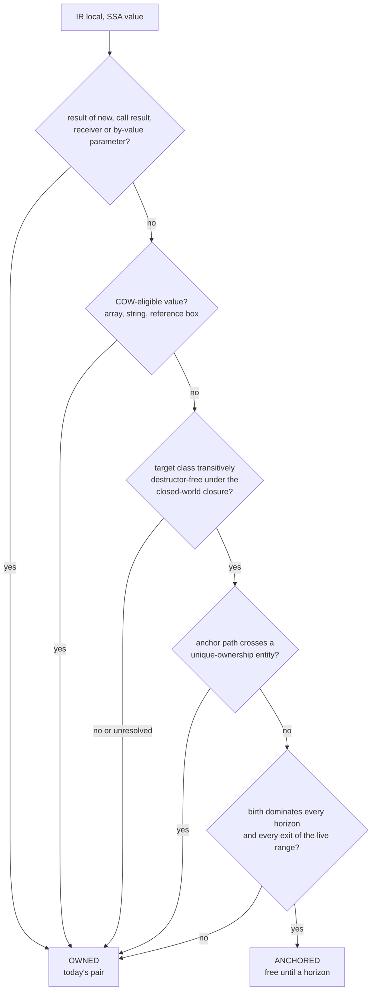
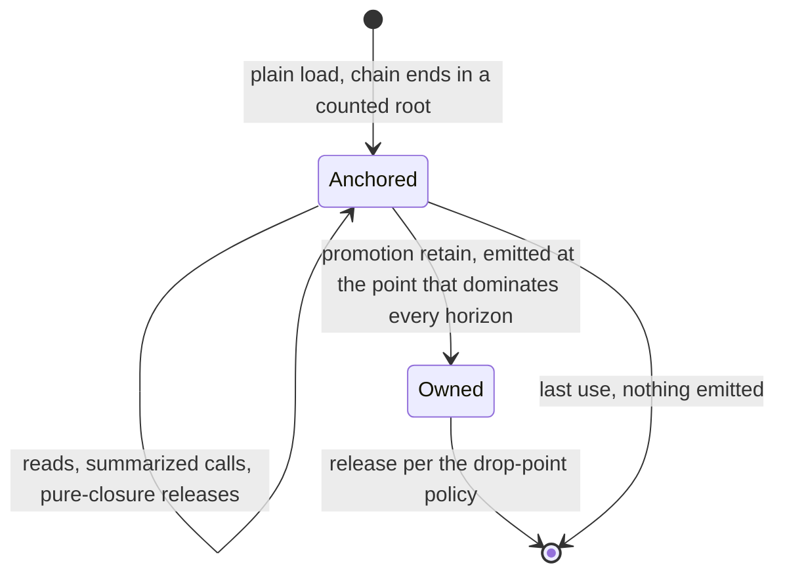
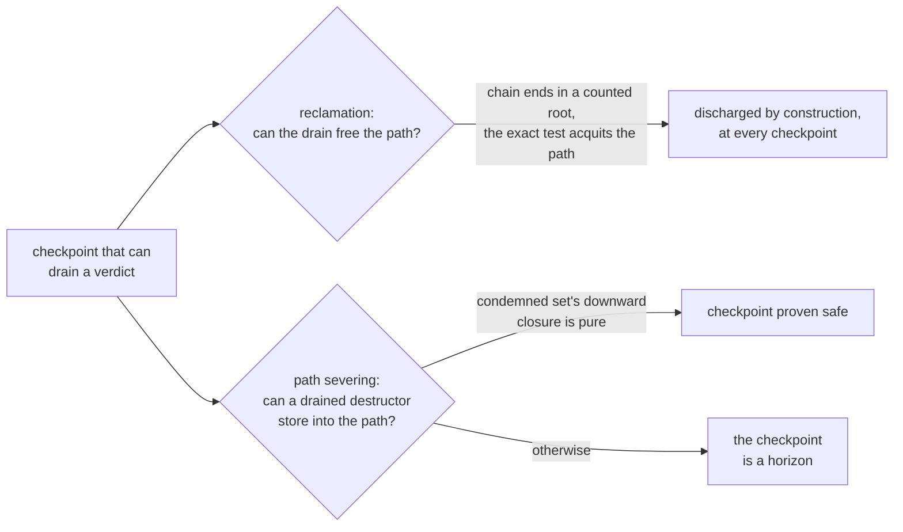

# Proof horizon: how one function is lowered

A reading aid for the proof-horizon design, written 2026-08-18
against revision 5 of `proof-horizon.md`, which stays normative
together with the rulings in `dev/DECISIONS.md` ("proof-horizon
granularity", "child-release order is language surface"). Nothing
here is implemented; the design is closed pending its Phase D gate.
The structures the lowering carries are catalogued in
`proof-horizon-structures.md`.

## The trade

Protection is priced per point of doubt, not per read, per copy or
per store. A local either holds a count — today's retain/release
pair — or is an uncounted borrow whose safety is a compiler proof,
paid for only where the proof ends: one ordinary retain at that
point, and nothing anywhere else. The collector, the header layout
and every runtime protocol are unchanged; the entire mechanism is a
choice of where the compiler emits pairs.

## The lattice decision, per local

Every IR local passes one cascade at compile time. Any "no" or any
analysis failure lands on owned, which is today's code, so every
mistake costs a pair and never a proof.



The base cases exist for four different reasons, and none of them is
horizon-crossing: call results and parameters because a borrowed
return would surface behind the callee's epilogue checkpoint and an
anchored parameter dies to re-entrancy; COW values because the
uniqueness test reads the count; destructor-bearing targets because
elision would move `__destruct` off the drop-point pin; unique
entities because a retain would write the occupancy sentinel.

## A borrow's life



The promotion point is the closest point dominated by the borrow's
birth that dominates every horizon and every exit of the live range;
a loop's horizon is dominated from before the loop, so the payment
stays one pair. A promoted borrow holds its count over a subrange of
exactly the lifetime today's code counts it over, which is both the
cost bound (never more than today) and the death-order argument.

## The horizon kinds

| Horizon | Why the proofs end there | What lifts it |
|---|---|---|
| call without a trusted summary | the callee may sever or release anything | a summary: no severable path, pure internal releases |
| dynamic dispatch, unclosed set | the callee is unknown | a closed class set |
| reflection | unbounded effects | nothing |
| by-reference escape | the local becomes writable elsewhere | nothing |
| release of a non-pure-closure class | eager death runs `__destruct` at the release site | transitive purity of the closure, NR counting impure |
| store to a chain local, or through a may-alias of a path base | severs the chain | must-not-alias via closed-class typed-property disjointness |
| checkpoint that can drain a verdict | drained destructors may sever | pure downward closure of the condemned set |
| suspension: yield, fiber | the resumption point is unknown | open question 2 of the design |

Two entries deserve their fine print. The release horizon has no
finality test — "may reach zero" is undecidable without count-value
analysis, so every qualifying release is a horizon — and the store
horizon covers assignment and `unset` of the anchor itself: a store
*to* a chain local ends `live(anchor)` whatever the purity of what
it displaces.

## A checkpoint's two threats



Reclamation needs no condition because the exact test balances
counted references and every chain edge is counted down from a
genuine root. Path severing binds any checkpoint that can drain a
verdict — under the hand-off design both the prologue's P2 calls
and the unchanged whole drain at an arbitrary pickup — and its
discharge instrument is transitive purity over the condemned set's
closure.

## One function, both lowerings

```php
function total(Cart $c) {      // $c: owned by convention (parameter)
    $items = $c->items;        // owned: array, COW-eligible
    $tax   = $c->tax;          // anchored: Tax is closed, pure,
                               //   destructor-free, typed field
    audit($c);                 // horizon: no summary for audit()
    return $tax->rate;         // last use of the borrow
}
```

Today `$tax` pays a retain at the load and a release at its drop
point. Under the scheme the compiler emits one retain immediately
before `audit(...)` — the closest point dominated by the load that
dominates the horizon and the exit — and the matching release at the
same drop point as today. If `audit()` gains a summary proving it
severs nothing on the `$c->tax` path and releases nothing impure,
both instructions disappear and `$tax` costs zero. `$items` pays
today's pair in either world: the lattice never elides a COW holder.

## What the runtime never sees

There is no protection set, no candidate-test arm, no death-branch
test and no new header state: promotion is an ordinary retain, so
`collector.rs` and `walk.rs` cannot distinguish a promoted borrow
from any owned local. The one protocol-level effect is budgetary,
not structural: a scope whose whole release run is elided emits no
batched ack pair, thinning epoch progress — the same budget
`owned-slots-and-the-walk.md` prices for the fast class, answered by
the compensating-poll rule that is that document's open question 3.

## What each instrument buys

Before any analysis lands, the sound defaults leave only read-only
lifetimes over destructor-free data free. Every widening is bought:

| Instrument | Widens |
|---|---|
| call summaries | calls, and the free region grows call-deep through store-free pure callees |
| transitive-purity classification | releases |
| closed-class typed-property disjointness | stores |
| condemned-closure purity | checkpoints |
| resumption-point summaries (open) | suspensions |

The graded corpus scan (`proof-horizon.md`, measurement 1) measures
the bought region per instrument, which is what makes the design's
economics decidable per class instead of on faith.
