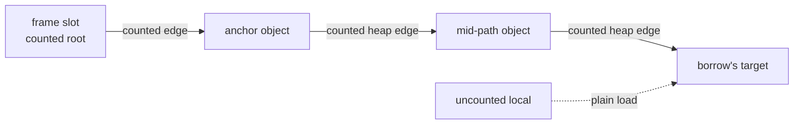
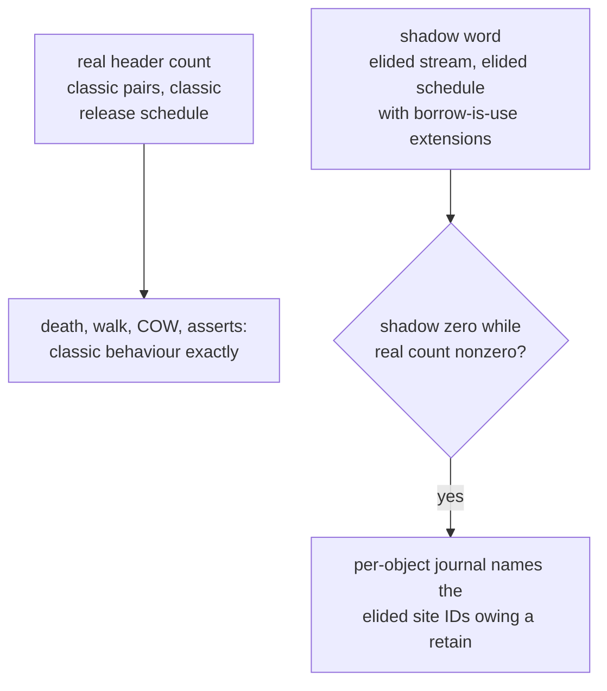

# Proof horizon data structures

The catalogue of every structure the proof-horizon design carries,
compile-time and instrument-side, with what consumes each. Companion
to `proof-horizon-lowering.md`, written 2026-08-18 against revision 5
of `proof-horizon.md`, which stays normative. Nothing is implemented;
the design is closed pending its Phase D gate.

## Where the state lives

The design's load-bearing property is that every structure below is
compile-time or instrument-side. The runtime table is a list of
non-changes, and each row is a soundness argument, not an economy:

| Runtime structure | Change | Why it must not change |
|---|---|---|
| `RcHeader` count | none | owned locals and promotions use today's pair; eager death and `__destruct` timing are pinned |
| COW uniqueness test | none | every COW holder is counted, so `refcount == 1` stays truthful |
| checkpoint protocol | none in code | the ack *rate* thins at fully-elided scope exits — a budget effect priced in the economics, not a protocol edit |
| collector: epoch, walk, exact test | none | no protection set, no candidate arm, no death-branch test; a promoted borrow is indistinguishable from an owned local |
| unique-ownership sentinel | none | never retained: convention sites count as references in the uniqueness proof, and demotion recompiles the owner |

## Compiler-side structures

| Structure | Per | Content | Consumer |
|---|---|---|---|
| lattice state | SSA value | `Owned`, or `Anchored(chain)` | the emitter |
| anchor chain | borrow | path edges ending in a counted root: frame slot, arena slot, static, immortal, FFI handle | chain invariant; checkpoint reclamation discharge |
| horizon set | borrow live range | every horizon site reachable in the range | promotion placement; the failure default |
| promotion point | promoted borrow | closest point dominated by the birth, dominating every horizon and every exit | the emitter; landing-pad sets |
| landing-pad set | call site | owned locals live at the site, static per site | unwind lowering |
| call summary | function | severable anchor paths; purity of internal releases; destructor reachability; **version** | the call-horizon lift; invalidation on stdlib updates |
| always-provable rule registry | admitted rule | statement, proof sketch, reviewer, date — one `dev/DECISIONS.md` entry each | the granularity ruling's bound |
| per-site certificate | deviating site (future) | anchor chain, summary IDs, horizon set | the independent checker |
| demotion worklist | unique entity | trigger sites: convention retains and horizon-reaching borrows | the whole-program fixpoint |

The certificate's checker warrants chain well-formedness, syntactic
horizon coverage and summary-version freshness; it cannot warrant
may-alias completeness, which it would inherit from the shared
oracle — that residue is what the shadow lowering exists to catch.

## The chain invariant, drawn

Every solid edge is counted, so at any drain a condemned component
intersecting the path has an external counted in-edge traceable to
the root and the exact test acquits it whole; an incoherent-array
skip on the path only inflates `RC − IN` toward roothood
(`src/walk.rs`, the give-up through `StorageHead::coherent`). The
uncounted arrow is the whole saving, and the store horizon guards
it: a store to any chain local, or through a may-alias of a path
base, ends the borrow's coverage.

## The shadow lowering, wired

One binary, two release schedules — with one schedule for both
streams a sound elision fires the signal and the diagnostic is dead
on arrival. Under the dual schedule the false-positive rate is
provably zero: shadow(target) equals real(target) minus the live
elided borrows, and a shadow zero under a live borrow means no
counted holder exists in the elided stream, which a sound elision's
intact chain forbids. Elisions made under always-provable rules, in
both regimes, enter the same journal, so no elision class is
uninstrumented.

## The instruments

| Instrument | Produces | Authority | Buildable |
|---|---|---|---|
| graded corpus scan | the doubt map: free-fraction bracket and the channels below | kill-only, reading the bracket | pre-D, compiler-free |
| summary-dependency channel | invalidation-share bracket per stdlib class | kill on the under-approximation only | pre-D, inside the scan |
| pair-cost-over-contexts sweep | the dispersion band the economics lacks | calibration | pre-D: the store probe's shape aimed at `ll_retain`/`ll_release` |
| release-build elision counter | elided-pair count from the shipping lowering | the economics' count; the counting build is never clocked | needs the compiler |
| shadow-count lowering | divergence detection with site naming | verification | needs the compiler |
| differential lowering | destructor sequence and death set per checkpoint batch | verification; nesting-insensitive by design | needs the compiler |
| Phase D publish census | borrow density per class, crossings per lifetime, live borrows per horizon, family coverage flags | the only gate that can open | Phase D |

## Scan channels

| Channel | Measures | Feeds |
|---|---|---|
| free-fraction bracket | lifetimes horizon-free under graded classification: provably-horizon / provably-free / unresolved | the kill rule |
| unresolved-receiver share | where the doubt concentrates on calls | receiver-resolution pricing |
| severing-store share | the may-alias horizon's weight | the disjointness instrument's value |
| purity tier per release | P0-syntactic / closure-unresolved / provably-impure, with a P2 share | the release horizon's weight |
| destructor-bearing-target share | the owned-from-birth exclusion's cost | the economics' population |
| referent static class | per-class regime pricing | the hybrid's selection |
| summary-dependency bracket | downstream recompilation blast radius | the standing-cost paragraph |

Checkpoint horizons appear in no channel: compiler-placed sites do
not exist in source, so both bounds omit them by construction — the
scan's recorded structural limit, not an oversight.
