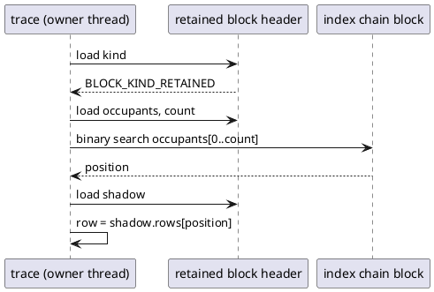

# Retained index ownership

A proposal to move the occupant index of a retained block out of the
process-global registry (`memory/retained.rs`) and into the block's own
header line, owned by the thread whose arena reset produced the block.
Status: ruled on 2026-09-01 and **superseded on the storage question**.
Edmond refused the per-thread chain of manager blocks below and ruled
that the list is written into the arena's own memory — the retained
block's own tail, else the reset's current block, else a fresh pool
block — with the count word atomic because `ll_free` is ABI. The ruling
is `dev/DECISIONS.md`, "a retained block's survivor list lives in the
arena's own memory, and the process registry goes"; the normative text is
`rfc/model/gc/rc-cycle.md`, "The survivor list of a retained block"; the
code is S36.9 slice (e). What stands of this document: the block answers
for itself, the words move into its collector line, and the refusals in
the last section. What is superseded: the manager chain, the thread-owner
word, thread-exit abandonment and adoption of retained blocks, and the
four open questions, each answered by the rfc entry. Kept as the record
of what was considered. The review that raised it is
`dev/CYCLE-COLLECTOR-REVIEW.md`, finding 3.

## What the registry is and who reads it

A retained block is a former request-arena block whose survivors were
promoted in place. It was bump-filled at mixed sizes, so a slot index
cannot be computed from an address, and the trace reaches a survivor's
shadow row by its position in a sorted array of occupant addresses
(`rfc/model/gc/rc-cycle.md`, "Where the shadow count lives"). That array,
with a live-occupant count and a pinned-payload count, is the block's
index.

Today the index is a value in one `Mutex<BTreeMap<block, Index>>` for the
whole process. Every operation takes the lock:

| caller | operation | when |
|---|---|---|
| `promote::index_retained_blocks` | `register` | at the reset, on the arena's thread |
| `cycle::row::resolve_edge_target` | `occupant_index` | per traced edge into the block, and per scan pop |
| `cycle::arena::index_space` | `occupant_count` | at the block's first touch by a trace |
| `reset_window::absorbs_retained_free` | `has_occupant_index` | per free inside a reset |
| `promote` | `pin`, `reset_pin_released` | at the reset |
| `stdapi::ll_free` | `occupant_freed` | per occupant death |
| `buffer_arena` | `payload_freed` | per pinned payload death |
| `heap::for_each_entity_slot` | `snapshot` | tests only (`cells::heap_census` is `#[cfg(test)]`) |

Every production reader asks about one block it already holds the
address of. The one enumeration has no production caller. The map exists
because `rc-walk` walked every block of the process once per epoch and
needed a list; that collector was deleted on 2026-08-26 and the registry
was kept for its lookup (`dev/DECISIONS.md`, that date). The lock is the
price of a map nobody enumerates.

## The proposal

The block answers for itself. Its 256-byte header line already carries
the collector line at offset 192, 64 bytes, which `promote` nulls before
stamping `BLOCK_KIND_RETAINED`; the shadow pointer, the reciprocal and
the size class use 16 of them. The index moves into the remaining 48:

```text
+192  shadow      *mut u8    this collection's row array, as today
+200  reciprocal  u32        unused for a retained block
+204  size_class  u32        unused for a retained block
+208  occupants   *const usize   sorted occupant addresses, null while unindexed
+216  count       u32        length of `occupants`; the index space
+220  live        u32        occupants not yet freed
+224  payloads    u32        pinned payloads not yet freed
+228  (28 bytes free to the end of the line)
```

`occupants == null` is today's `indexed == false`: a block pinned for
bytes before its index exists. The three counters replace `Index::live`,
`Index::payloads` and the map entry's presence.

Ownership. The block belongs to the thread whose reset stamped it, the
way an entity block belongs to the heap that commissioned it. That
thread is the only writer of the four words; the trace on that thread
reads them without synchronization, because the trace runs on the owner
(`rfc/model/gc/rc-cycle.md`, "Concurrency"). The block goes home when
`live` and `payloads` both read zero, through `give_block_back` as today.

Where the array is stored. The block cannot hold its own index: it is
full of survivors and has no free tail a reset can count on. The array is
manager memory, `BLOCK_KIND_GC_METADATA`, from a per-thread chain of
64 KiB blocks bumped at each reset. One chain block holds the indexes of
many retained blocks; it carries a count of indexes still standing in
it, and returns to the pool when that count reaches zero. This is the
same shape as the candidate queue's segments and the trace arena, and it
satisfies the S36.9 rule that no `Vec`, `Arc` or `BTreeMap` stands on a
collection path. An index dies before its block does, as the registry's
`empty_now` orders it today.

The reset itself still builds the per-block occupant lists in `promote`
with `HashMap` and `Vec`. The reset is not a collection path and the
rule does not reach it; the copy into the chain happens once at
`register`.

## Operations after the change

- **Register** (reset, owner thread): sort the occupants, count the
  live ones, bump the array into the index chain, write the four words,
  publish with the kind's release store as today.
- **Reach** (trace, owner thread): `resolve_edge_target` reads the
  kind, then `occupants` and `count` from the same header line, and
  binary-searches the array. No lock. `index_space` reads `count`.
- **Occupant freed** (`ll_free`, owner thread): decrement `live`; both
  zero, give the block back and decrement the chain block's index
  count.
- **Payload freed**, **pin**, **reset pin released**: the same on
  `payloads`.
- **Thread exit**: a retained block with live occupants is abandoned and
  adopted like an entity block (`heap::ll_thread_exit`); its index chain
  goes with the last block of the chain, or is adopted with it. Which of
  the two is open (below).
- **Tests**: `for_each_entity_slot` enumerates retained blocks by
  scanning the pool's regions for `BLOCK_KIND_RETAINED`, as it already
  does for entity blocks, and reads the index from the header.



What the diagram omits: the first touch that allocates the row array
(`cycle/arena.rs`, unchanged), and the free path, which writes `live`
on the same header line and never touches the chain except to release
it.

## What it removes

`Mutex`, `BTreeMap`, `Arc<[usize]>` and `snapshot` in
`memory/retained.rs`; the registry lock on every edge into a retained
block and on every retained free; the `Arc` clone `occupant_count`
performs per touched block. `retained.rs` keeps the arithmetic over the
header and the occupancy test. The alternative in `PLAN.md`, "The
retained arm's per-edge registry lock" (hold the `Arc` in the row
array's prologue for the trace's length), removes the per-edge lock and
keeps the map, the `Arc` and the per-free lock; it is the smaller change
and the weaker one.

Cost, not measured: the trace's retained arm goes from lock, tree
lookup and search to two header loads and search. The free path loses
one lock. The reset gains one bump copy per block it registers.

## What it depends on

- **Thread isolation.** A retained occupant freed from another thread
  would write `live` on a header the owner also writes. Entity blocks
  post such a free to `remote_free`; a retained block has no such
  channel and this proposal does not add one. It stands on the same
  prerequisite as the trace: no thread references another thread's
  blocks (`rfc/dev/ALGORITHM-AUDIT.md`, A4, B3, C3).
- **A block owner word.** A retained block's header holds `kind` and
  `next` and nothing that names a thread. Abandonment and adoption need
  one; `HeapBlockHeader::owner` is the model, and whether a retained
  block takes the whole `HeapBlockHeader` or an owner word of its own is
  open.
- **S38.3.** A trace on the owner must still hold a block back from the
  pool while it addresses rows in it; that parking is S38.3's and is
  not changed here.

## Open questions for the rfc entry

1. Does a retained block carry `HeapBlockHeader` with its `owner`, or an
   owner word in the collector line?
2. At thread exit, does the index chain move with the adopted blocks or
   is each surviving index re-registered into the adopter's chain?
3. Is the index chain's block released at its last index, or held for
   the thread's life like the queue base? The first bounds memory, the
   second removes a release from the free path.
4. Whether `for_each_entity_slot` may read another thread's index
   without a lock: it requires a quiescent mutator already, and the
   answer is yes under that contract.

## Decisions taken in the working, for Edmond to overturn

- The array is stored in a per-thread chain of manager blocks rather
  than beside the retained block or in a block of its own per index: a
  block per index is 64 KiB for at most 32 KiB, and the retained block
  has no reliable free tail.
- The chain block is released at its last index rather than at thread
  exit; question 3 above.
- The reset keeps `HashMap` and `Vec` while it groups survivors; the
  S36.9 rule names collection paths and the reset is not one.
