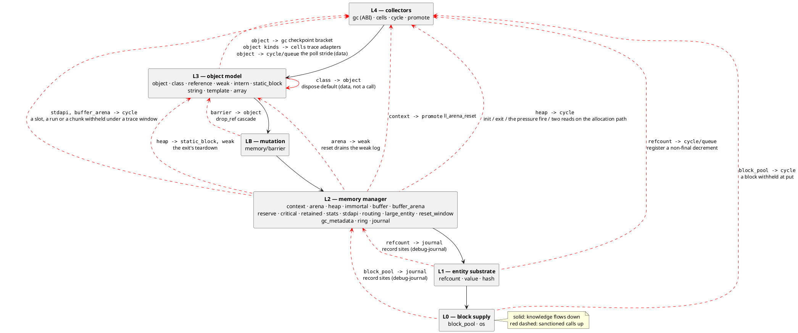
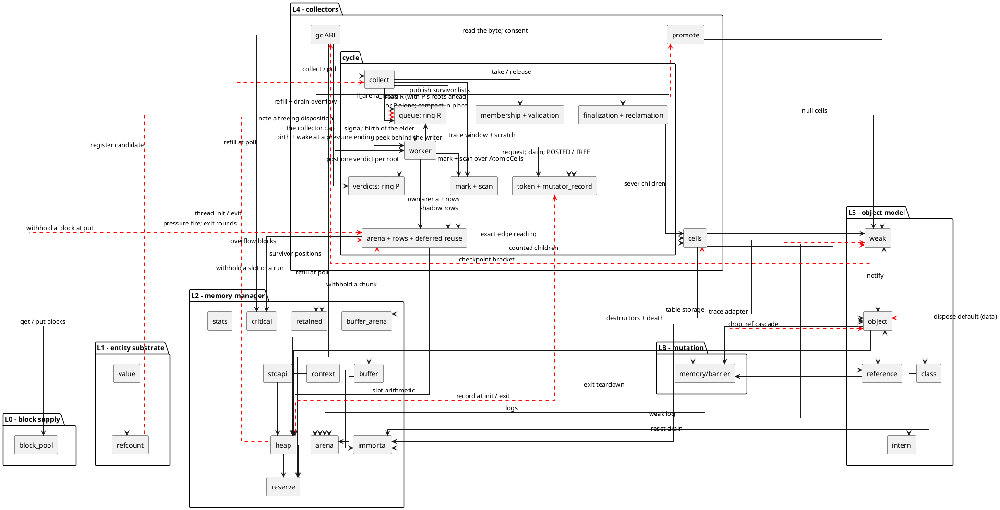
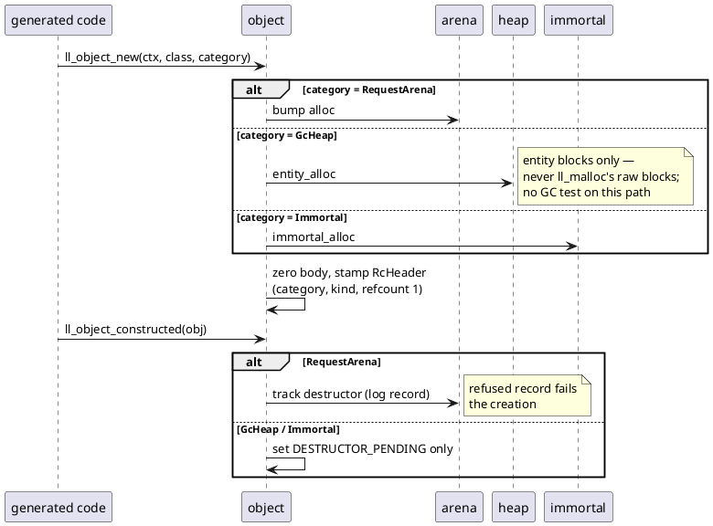
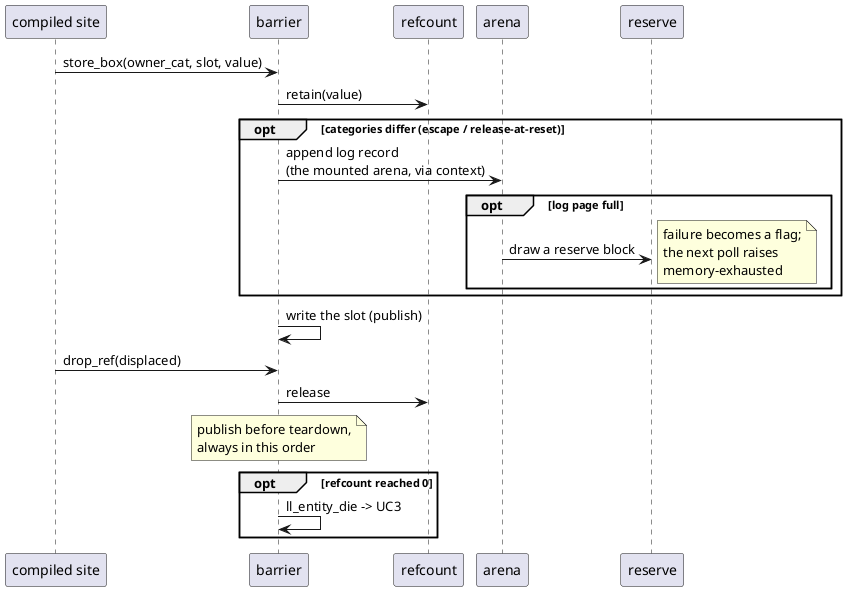
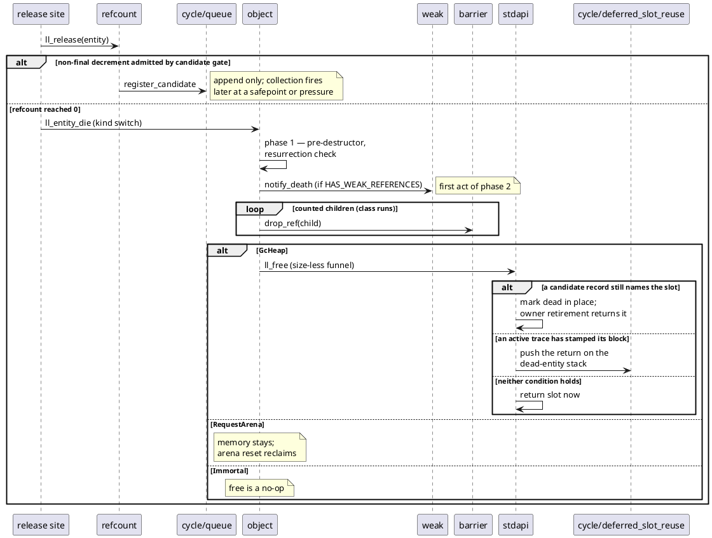
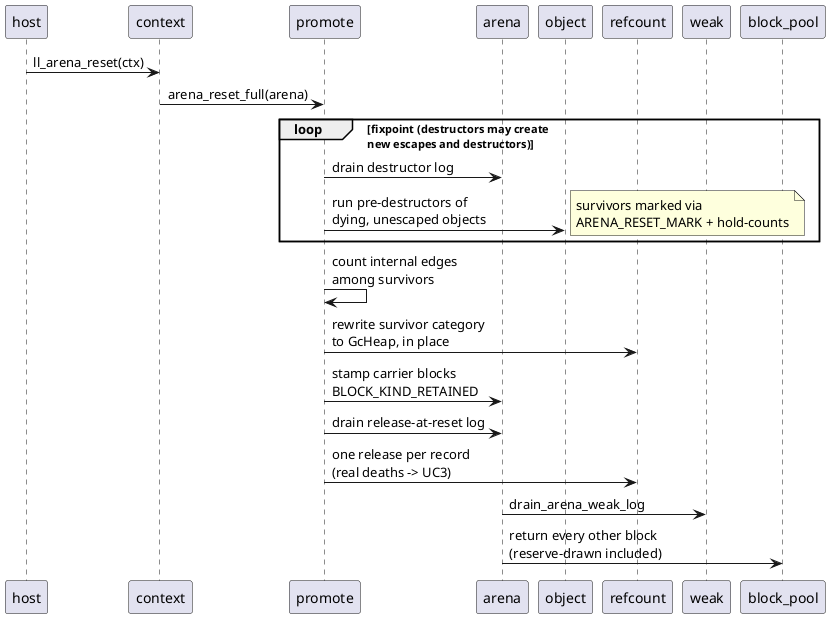
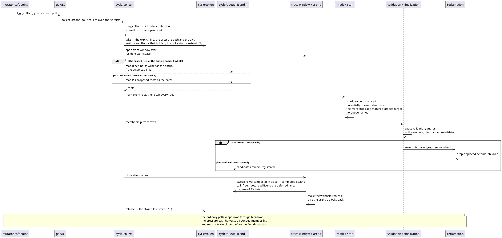
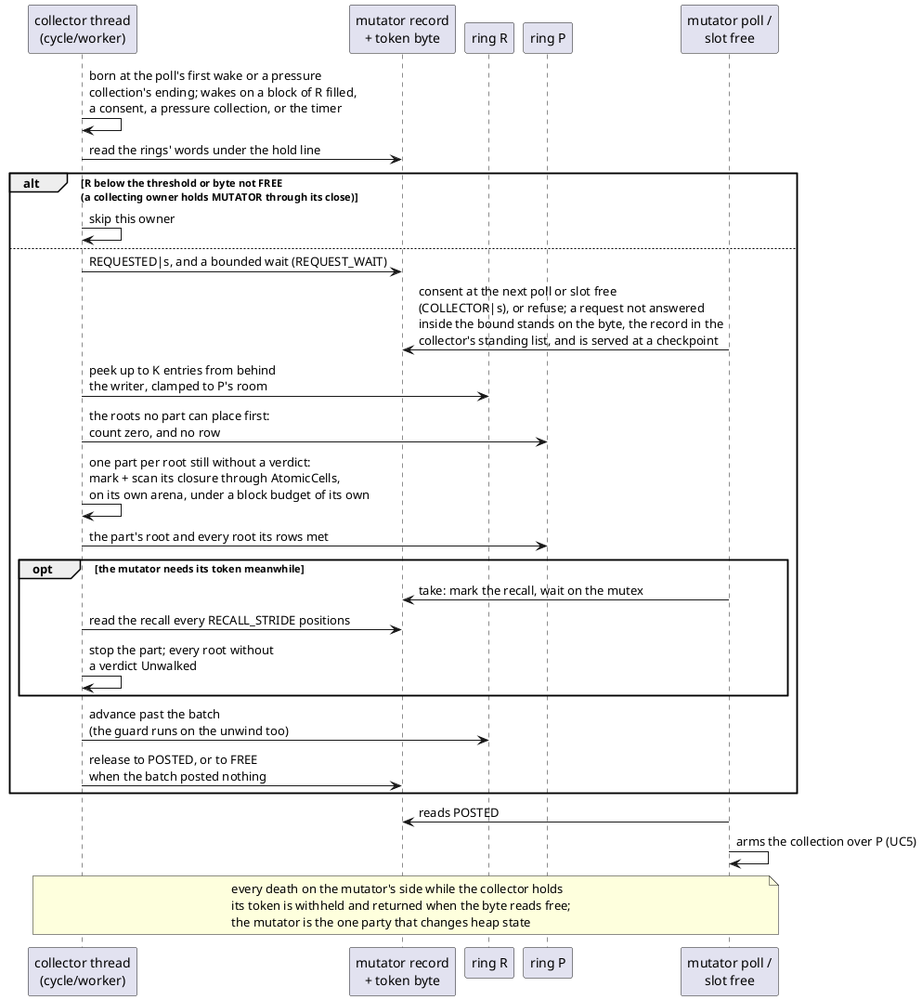

# Architecture, visually

A visual companion to `dev/ARCHITECTURE.md`, which is the source of
truth: the knowledge table with the full "knows / does not know"
contract, the shared-resource ledger and the invariant list live
there. This file shows the same structure as diagrams — who knows
whom, who is responsible for what, and the key use cases as
sequences. When a boundary changes, both files change in the same
commit (`dev/WORKFLOW.md`).

The diagrams show the implementation, not the destination. The in-line
`rc-cycle` path and the collector thread beside it are both built and both
drawn; what is not built is outside the crate: the compiler's proof that
fills `CLASS_ACYCLIC`, and a ruling on the turnover period
(`PLAN.md`, "What S37 named and left"). The deleted
`rc-walk` and `rc-trace` structures remain on `archive/pre-rc-cycle`, not in
this picture.

Diagrams are PlantUML, embedded as fenced blocks; render on demand
(IDE plugin or any PlantUML processor). No generated images are
committed.

## Layers and who knows whom

Knowledge flows downward: a module may use anything at or below its own layer.
The sanctioned upward edges are dashed and red; their complete entry-point
list is in `dev/ARCHITECTURE.md`. Anything new pointing up is a design event,
not an edit.

### Full wiring

Principal structural production edges between modules; the exhaustive table is
`dev/ARCHITECTURE.md`. Ubiquitous hubs are omitted here: everyone →
`refcount`/`value`, context resolution, the `stdapi` free funnel, and
package-level block supply. Use the layer picture above for orientation and
this one for the collector boundary.

`block_pool` reaches above itself at two points: the block a foreign trace
withholds at `put`, and the journal's record sites under `debug-journal`;
its `cycle::queue` references are the shared test-lock harness. Red dashed
edges are the sanctioned upward ones; the complete table is
`dev/ARCHITECTURE.md`'s.

## What each component is responsible for

One line each; the full contract (the "knows" column, shared
resources, invariants) is in `dev/ARCHITECTURE.md`.

| Module | Responsible for | Notably does NOT know |
|---|---|---|
| `block_pool` | 2 MB OS regions → aligned 64 KB blocks; global chain + thread caches; region registry | what any payload contains |
| `arena` *(hot)* | request arena: bump alloc; self-contained logs (destructor / escapee / release-at-reset); drain primitives for reset | the reset discipline itself — promote drives it |
| `heap` *(hot)* | small-object heap (mimalloc model), raw + entity populations, remote free, abandonment, slot enumeration | entity kinds, verdicts, classes |
| `immortal` | global bump region, never freed | contents of what it hosts |
| `buffer` | growable headerless payload over the mounted arena | entity lifecycle |
| `buffer_arena` | long-lived buffer blocks, per-block free lists, pressure modes | the object heap, entities |
| `reserve` | two blocks per thread for store-barrier log growth | what a log records |
| `critical` | eight blocks per thread: the collection's arena above its workspace, after the pool refuses; the candidate ring when both spare cells are empty, which asks no pool first | what either consumer stores |
| `routing` | where a memory category's bytes come from: entity, body, and the slot limit | what kind of entity is being placed |
| `large_entity` | one entity per allocation past the size classes: a pooled block or an OS-direct run, and the registry of runs | the entity past its first eight bytes |
| `reset_window` | the window a reset holds over its own frees and the COW reconciliation's log | which entity is a survivor — promote says |
| `gc_metadata` | the one door through which collection takes and returns pool blocks; the count and its high-water mark | what a GC block holds |
| `os` | `mmap` / `VirtualAlloc` behind an aligned span; every refusal reported | what a region holds |
| `ring` | a single-producer single-consumer ring of pool blocks; peek/commit, quiet pack, splice | what an entry means |
| `journal` | 32-byte records in one ring per thread, drawn past the thread-started check; read back by a mark; sites under `debug-journal` | what an event means |
| `retained` | survivor-list lookup and held-occupant accounting for retained arena blocks | entity kinds and verdicts |
| `stats` | block-granular telemetry, zero hot-path tax | per-object events |
| `stdapi` | size-less malloc/free front door; routes by block kind | entity semantics |
| `context` | `LLContext` + TLS current context; composition root; `ll_arena_reset` ABI | class layout, GC strategy |
| `barrier` *(hot)* | store-barrier micro-ops: publish (`store_ptr`/`store_box`), `drop_ref`, escape recording | per-site composition (lowering's) |
| `refcount` | the 8-byte header at offset 0: refcount + flag word; retain/release | entity bodies, blocks, when to collect |
| `value` | the 16-byte Box: payload + tag + flags | unboxed representations (compiler contract) |
| `hash` | `hash_bytes` (rapidhash V3), the seed and the folding axis, the per-process key | what is being hashed |
| `intern` | interned names as immortal string entities; lookup table | classes — it only serves them names |
| `class` | descriptors: inline vtable train, itables, Cohen display, layout runs, trace lists | instance state, categories, GC |
| `object` | factory, constructed hook, three-phase death, kind-switched `ll_entity_die` | collector internals, block internals |
| `reference` | the `&` reference box, entity kind 3 | classes |
| `weak` | weak cell (kind 11) = canonical `WeakReference`; per-thread weak table; every notification rule | *when* to notify — the death sites' duty |
| `static_block` | the per-thread registry of static blocks and the exit pass that releases their roots | what a root points at |
| `string` | the string entity in two layouts told apart by kind code; append, separate, carry at reset | classes, arrays, the collector |
| `template` | the interpolated template: a static shape, an instance under one class, `flatten` | floats and objects, which it refuses |
| `array` | the mixed vector and the ordered hash under one head a walker may read; element operations; the entity over them | the collector's rows |
| `gc` | GC ABI, the poll's duties in order, the arming word, dispatch into `cycle::collect`, the signal to the collector | collector internals and arming policy |
| `cells` | kind-dispatched counted-child trace and sever adapters, for the owner (`PlainCells`) and for a collector thread (`AtomicCells`) | slots and occupancy (heap's side) |
| `cycle` | the candidate ring R and the verdict ring P; the trace token in a record the process keeps; the in-line collection — mark/scan over shadow rows, exact validation, finalization, reclamation, the close's compaction; the collector thread's round and batch | entity-kind layout and size-class arithmetic |
| `promote` | arena death with promotion: fixpoint, edge count, retain blocks, release log | copying/evacuation (future) |

## Use cases

### UC1 — Object allocation

### UC2 — Reference store (overwrite)

### UC3 — Entity death, refcount path

### UC4 — Arena reset

### UC5 — In-line cycle collection

### UC6 — The collector thread's batch

