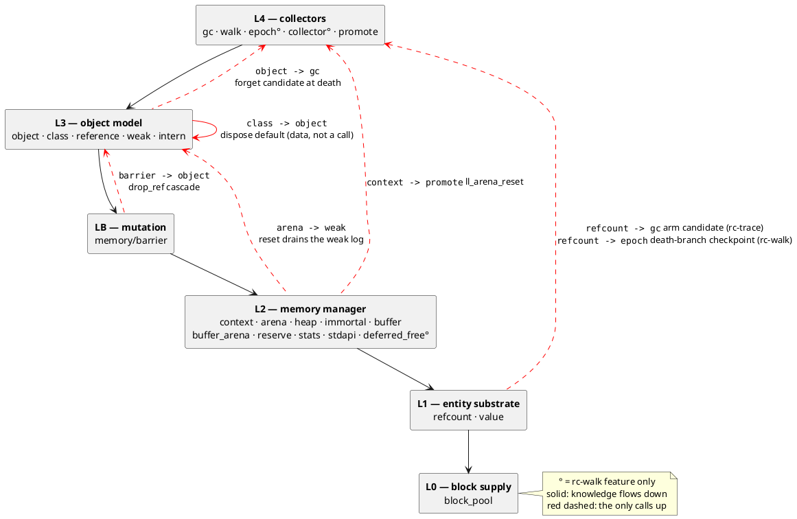
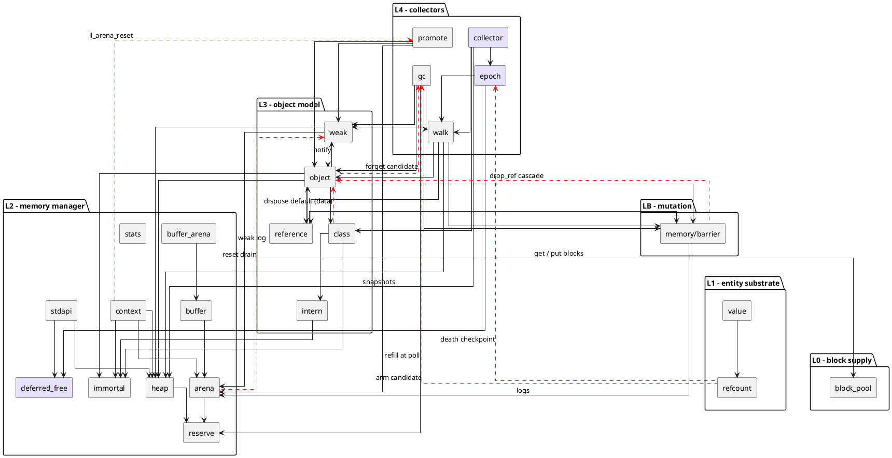
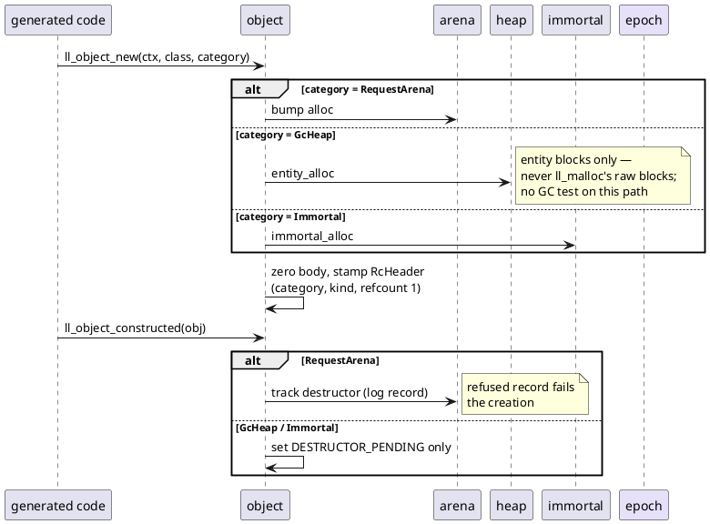
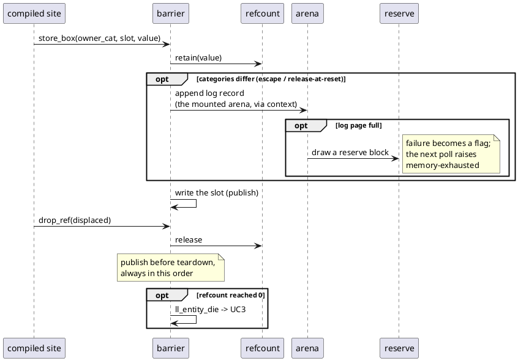
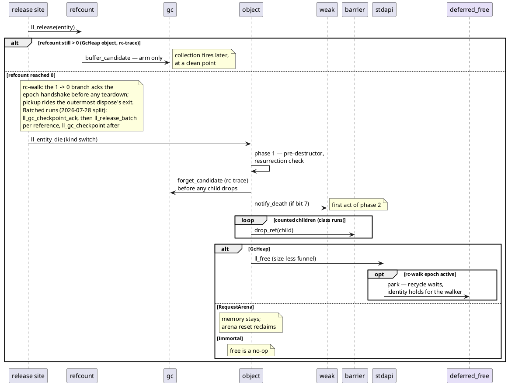
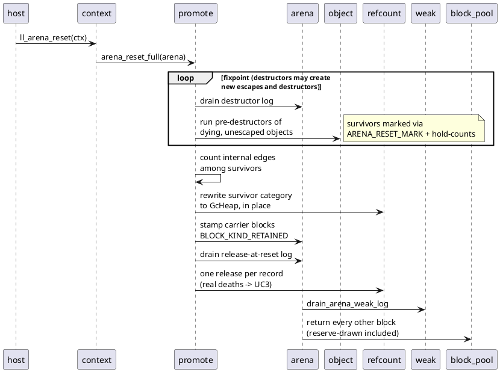
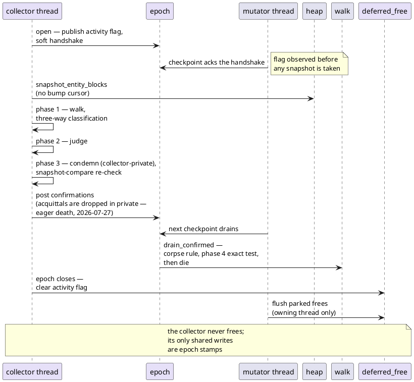

# Architecture, visually

A visual companion to `dev/ARCHITECTURE.md`, which is the source of
truth: the knowledge table with the full "knows / does not know"
contract, the shared-resource ledger and the invariant list live
there. This file shows the same structure as diagrams — who knows
whom, who is responsible for what, and the key use cases as
sequences. When a boundary changes, both files change in the same
commit (`dev/WORKFLOW.md`).

Diagrams are PlantUML, embedded as fenced blocks; render on demand
(IDE plugin or any PlantUML processor). No generated images are
committed.

## Layers and who knows whom

Knowledge flows downward: a module may use anything at or below its
own layer. Exactly seven upward edges exist (dashed, red) — all of
them entity death or GC scheduling, each entered at a named point.
Anything new pointing up is a design event, not an edit.

### Full wiring

Every structural production edge between modules (ubiquitous hubs
omitted: everyone → `refcount`/`value`, context resolution, the
`stdapi` free funnel; block supply drawn once, package-level). Dense
by nature — use the layer picture above for orientation and this one
for lookup.

Violet components exist only under the `rc-walk` cargo feature.
`block_pool` knows nothing above itself; its references to
heap/reserve are the shared test-lock harness.

## What each component is responsible for

One line each; the full contract (the "knows" column, shared
resources, invariants) is in `dev/ARCHITECTURE.md`.

| Module | Responsible for | Notably does NOT know |
|---|---|---|
| `block_pool` | 2 MB OS regions → aligned 64 KB blocks; global chain + thread caches; region registry | what any payload contains |
| `arena` *(hot)* | request arena: bump alloc; self-contained logs (destructor / escapee / release-at-reset); drain primitives for reset | the reset discipline itself — promote drives it |
| `heap` *(hot)* | small-object heap (mimalloc model), raw + entity populations, remote free, abandonment, slot enumeration | entity kinds, verdicts, classes |
| `immortal` | global bump region, never freed | contents of what it hosts |
| `buffer` | growable headerless payload over the mounted arena | entity lifecycle |
| `buffer_arena` | long-lived buffer blocks, per-block free lists, pressure modes | the object heap, entities |
| `reserve` | two blocks per thread so barrier log growth cannot fail | what a log records |
| `stats` | block-granular telemetry, zero hot-path tax | per-object events |
| `stdapi` | size-less malloc/free front door; routes by block kind | entity semantics |
| `deferred_free` *(rc-walk)* | activity flag; parked-free lists through bytes 8–15; post-epoch flush | which kinds park (stdapi filters), verdicts |
| `context` | `LLContext` + TLS current context; composition root; `ll_arena_reset` ABI | class layout, GC strategy |
| `barrier` *(hot)* | store-barrier micro-ops: publish (`store_ptr`/`store_box`), `drop_ref`, escape recording | per-site composition (lowering's) |
| `refcount` | the 8-byte header at offset 0: refcount + flag word; retain/release | entity bodies, blocks, when to collect |
| `value` | the 16-byte Box: payload + tag + flags | unboxed representations (compiler contract) |
| `intern` | interned names as immortal string entities; lookup table | classes — it only serves them names |
| `class` | descriptors: inline vtable train, itables, Cohen display, layout runs, trace lists | instance state, categories, GC |
| `object` | factory, constructed hook, three-phase death, kind-switched `ll_entity_die` | collector internals, block internals |
| `reference` | the `&` reference box, entity kind 3 | classes |
| `weak` | weak cell (kind 5) = canonical `WeakReference`; per-thread weak table; every notification rule | *when* to notify — the death sites' duty |
| `gc` | rc-trace cycle collector (Bacon–Rajan); arm-vs-fire; the `ll_gc_maybe_collect` poll | arming policy (compiler's) |
| `walk` | kind-dispatched tracer, census, whole-heap collection, Phase-4 drains | slots and occupancy (heap's side) |
| `epoch` *(rc-walk)* | mutator side: handshake ack, verdict queue, non-reentrant checkpoint | collector phases |
| `collector` *(rc-walk)* | collector side: steppable epoch state machine, Phases 1–3 | freeing (never frees), the weak table |
| `promote` | arena death with promotion: fixpoint, edge count, retain blocks, release log | copying/evacuation (future) |

## Use cases

### UC1 — Object allocation

### UC2 — Reference store (overwrite)

### UC3 — Entity death, refcount path

### UC4 — Arena reset

### UC5 — rc-walk collection epoch

